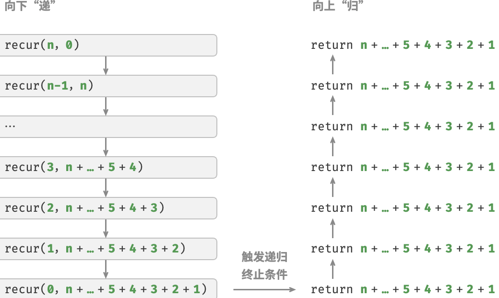

<h1 style="text-align: center;"><strong>Algorithm</strong></h1>

- [基本数据类型](#基本数据类型)
- [尾递归](#尾递归)
- [References](#references)

<br></br>


# 基本数据类型


# 尾递归
如果函数在返回前最后一步才递归调用，则该函数可被编译器或解释器优化，使其在空间效率上与迭代相当。这种情况被称为尾递归（tail recursion）。

- 普通递归：当函数返回到上一层函数后，需继续执行代码，因此系统需保存上一层调用上下文。
- 尾递归：递归调用是函数返回前最后一个操作，意味函数返回到上一层后，无须继续执行其他操作，因此无须保存上一层函数上下文。

以计算$1+2+...+n$为例，可将结果`res`设为函数参数，从而实现尾递归：

```go
// 普通递归
func recur(n int) int {
    if n == 1 { // 终止条件
        return 1
    }

    res := recur(n - 1) // 递：递归调用
    return n + res // 归：返回结果
}

// 尾递归
func tailRecur(n int, res int) int {
    if n == 0 { // 终止条件
        return res
    }

    return tailRecur(n-1, res+n) // 尾递归调用
}
```

对比普通递归和尾递归，两者求和操作执行点不同：
* 普通递归：求和操作在“归”过程中执行，每层返回后都要再执行一次求和操作。
* 尾递归：求和操作在“递”过程中执行，“归”的过程只需层层返回。



理论上，尾递归空间复杂度可优化至$O(1)$。不过多数编程语言（Java、Python、C++、Go、C#等）不支持自动优化尾递归，因此常认为空间复杂度是$O(n)$。

<br></br>


# References
* [Hello Algorithm](hello-algo.com)