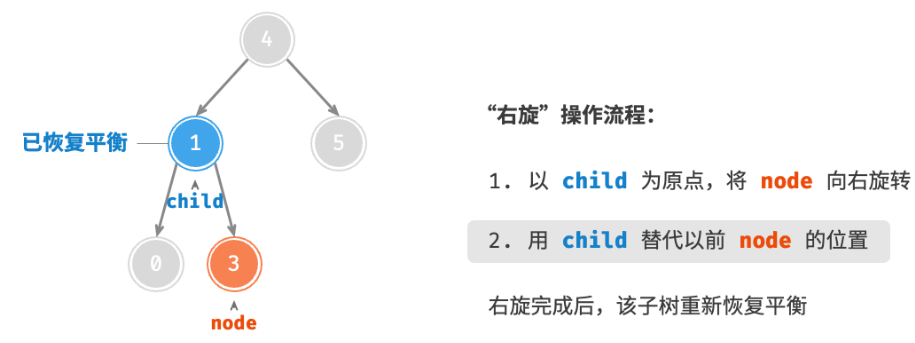

<h1 style="text-align: center;"><strong>AVL</strong></h1>

<br></br>


# What
二叉搜索树在多次插入和删除后，可能退化为链表。而AVL树就是解决这个问题，使操作时间复杂度仍旧是$O(\log n)$。AVL树既是二叉搜索树，也是平衡二叉树，因此是平衡二叉搜索树。

```go
type TreeNode struct {
    Val    int       // 节点值
    Height int       // 节点高度
    Left   *TreeNode // 左子节点引用
    Right  *TreeNode // 右子节点引用
}

// 获取节点高度
func (t *aVLTree) height(node *TreeNode) int {
    if node != nil { // 空节点高度为 -1 ，叶节点高度为 0
        return node.Height
    }
    return -1
}

// 更新节点高度
func (t *aVLTree) updateHeight(node *TreeNode) {
    lh := t.height(node.Left)
    rh := t.height(node.Right)
    if lh > rh {
        node.Height = lh + 1
    } else {
        node.Height = rh + 1
    }
}
```

<br></br>


# 平衡因子
节点平衡因子为节点左子树高度减去右子树高度，同时规定空节点平衡因子为0。

> 设平衡因子为$f$，则一棵AVL树任意节点平衡因子皆满足$-1 \le f \le 1$。

```go
func (t *aVLTree) balanceFactor(node *TreeNode) int {
    if node == nil {
        return 0
    }

    return t.height(node.Left) - t.height(node.Right)
}
```

<br></br>


# 旋转操作
AVL树特点在于旋转rotation，它能在不影响中序序列前提下，使失衡节点恢复平衡。换句话说，旋转操作既能保持“二叉搜索树”的性质，也能使树重新变为“平衡二叉树”。将平衡因子绝对值 > 1的节点称为失衡节点。根据节点失衡情况，旋转操作分为四种：右旋、左旋、先右旋后左旋、先左旋后右旋。

<br>


## 右旋
针对左子树过高的节点，通过右旋使左子树高度降低，右子树高度升高，使节点平衡。




当节点`child`有右子节点（记为`grand_child`）时，需在右旋中添加一步，将`grand_child`作为`node`左子节点。


```go
func (t *aVLTree) rightRotate(node *TreeNode) *TreeNode {
    child, grandChild := node.Left, child.Right
    // 以 child 为原点，将 node 向右旋转
    child.Right = node
    node.Left = grandChild
    // 更新节点高度
    t.updateHeight(node)
    t.updateHeight(child)
    // 返回旋转后子树的根节点
    return child
}
```

<br>


## 左旋
针对右子树过高节点，通过左旋使右子树高度降低，左子树高度升高，使节点平衡。


同理，当节点`child`有左子节点`grand_child`时，需在左旋中添加一步，将`grand_child`作为`node`右节点。


因为右旋和左旋在逻辑上是对称的，只需将右旋代码中`left`和`right`互换即得左旋实现代码：

```go
func (t *aVLTree) leftRotate(node *TreeNode) *TreeNode {
    child, grandChild := node.Right, child.Left
    // 以 child 为原点，将 node 向左旋转
    child.Left = node
    node.Right = grandChild
    // 更新节点高度
    t.updateHeight(node)
    t.updateHeight(child)

    return child
}
```

<br>


## 先左旋后右旋
适用左子树的右子树过高情况。步骤：
1. 先对左子树左旋。
2. 再对根节点右旋。
3. 返回旋转后的根节点。
4. 更新节点高度。

如下所示，先对`child`左旋，再对`node`右旋。


<br>


## 先右旋后左旋
适用右子树的左子树过高情况。步骤：
1. 先对右子树右旋。
2. 再对根节点左旋。
3. 返回旋转后的根节点。
4. 更新节点高度。

如下所示，先对`child`右旋，再对`node`左旋。


<br>


## 旋转的选择


Conditions for 4 rotation cses:

| Balance factor of unbalanced node | Balance factor of child node | Rotation        |
| --------------------------------- | ---------------------------- | --------------- |
| $> 1$ (Left-leaning tree)         | $\geq 0$                     | Right           |
| $> 1$ (Left-leaning tree)         | $<0$                         | Left then right |
| $< -1$ (Right-leaning tree)       | $\leq 0$                     | Left            |
| $< -1$ (Right-leaning tree)       | $>0$                         | Right then left |

```go
func (t *aVLTree) rotate(node *TreeNode) *TreeNode {
    bf := t.balanceFactor(node) // 获取node平衡因子，bf指t.balanceFactor
    // 左偏树
    if bf > 1 {
        if t.balanceFactor(node.Left) >= 0 {
            return t.rightRotate(node) // 右旋
        }
        // 先左旋后右旋
        node.Left = t.leftRotate(node.Left)
        return t.rightRotate(node)
    }
    // 右偏树
    if bf < -1 {
        if t.balanceFactor(node.Right) <= 0 {
            return t.leftRotate(node) // 左旋
        }
        // 先右旋后左旋
        node.Right = t.rightRotate(node.Right)
        return t.leftRotate(node)
    }
    return node // 平衡树，无须旋转
}
```

<br></br>


# 常用操作
## 插入节点
AVL树插入操作与BST类似。唯一区别在于，在AVL树插入节点后，从该节点到根节点路径上可能出现一系列失衡节点。因此，需从这个节点自底向上执行旋转操作，使所有失衡节点平衡。

```go
func (t *aVLTree) insert(val int) {
    t.root = t.insertHelper(t.root, val)
}

func (t *aVLTree) insertHelper(node *TreeNode, val int) *TreeNode {
    if node == nil {
        return NewTreeNode(val)
    }
    // 1. 查找插入位置并插入节点
    if val < node.Val.(int) {
        node.Left = t.insertHelper(node.Left, val)
    } else if val > node.Val.(int) {
        node.Right = t.insertHelper(node.Right, val)
    } else {
        return node // 重复节点不插入，直接返回
    }
    // 更新节点高度
    t.updateHeight(node)
    // 2. 旋转，使子树重新平衡
    node = t.rotate(node)
    
    return node // 返回子树根节点
}
```

<br>


## 删除节点
在BST删除基础上，需从底至顶旋转，使所有失衡节点平衡。

```go
func (t *aVLTree) remove(val int) {
    t.root = t.removeHelper(t.root, val)
}

func (t *aVLTree) removeHelper(node *TreeNode, val int) *TreeNode {
    if node == nil {
        return nil
    }
    // 1. 查找节点并删除
    if val < node.Val.(int) {
        node.Left = t.removeHelper(node.Left, val)
    } else if val > node.Val.(int) {
        node.Right = t.removeHelper(node.Right, val)
    } else {
        if node.Left == nil || node.Right == nil {
            child := node.Left
            if node.Right != nil {
                child = node.Right
            }
            if child == nil {
                return nil // 子节点数量 = 0 ，直接删除并返回
            } else {
                node = child // 子节点数量 = 1 ，直接删除node
            }
        } else {
            // 子节点数量 = 2 ，则将中序下个节点删除，并用该节点替换当前节点
            temp := node.Right
            for temp.Left != nil {
                temp = temp.Left
            }
            node.Right = t.removeHelper(node.Right, temp.Val.(int))
            node.Val = temp.Val
        }
    }
    // 更新节点高度
    t.updateHeight(node)
    // 2. 旋转，使子树平衡
    node = t.rotate(node)
    
    return node // 返回子树的根节点
}
```