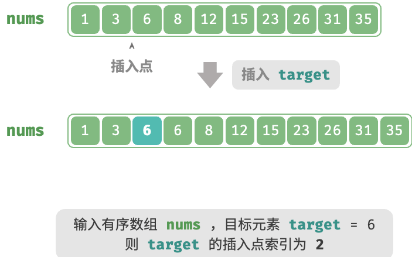

<h1 style="text-align: center;"><strong>Binary Search</strong></h1>

<br></br>


# 二分查找
方法一：

```go
func binarySearch(nums []int, target int) int {
    // 初始化双闭区间 [0, n-1] ，即 i, j 分别指向数组首元素、尾元素
    i, j := 0, len(nums)-1
    // 循环，当搜索区间为空时跳出（当 i > j 时为空）
    for i <= j {
        m := i + (j-i)/2      // 计算中点索引 m
        if nums[m] < target { // 此情况说明 target 在区间 [m+1, j] 中
            i = m + 1
        } else if nums[m] > target { // 此情况说明 target 在区间 [i, m-1] 中
            j = m - 1
        } else { // 找到目标元素，返回其索引
            return m
        }
    }
    // 未找到目标元素，返回 -1
    return -1
}
```

方法二：

```go
func binarySearch(nums []int, target int) int {
    // 初始化左闭右开区间 [0, n) ，即 i, j 分别指向数组首元素、尾元素+1
    i, j := 0, len(nums)
    // 循环，当搜索区间为空时跳出（当 i = j 时为空）
    for i < j {
        m := i + (j-i)/2
        if nums[m] < target { // 此情况说明 target 在区间 [m+1, j) 中
            i = m + 1
        } else if nums[m] > target { // 此情况说明 target 在区间 [i, m) 中
            j = m
        } else {
            return m
        }
    }
    return -1
}
```

<br></br>


# 二分查找插入点
## 无重复元素
给定长度$n$的有序数组`nums`，不存在重复元素。将`target`插入`nums`并保持有序。若已存在`target`，则插入其左方。返回插入后`target`在数组中索引。



采用分治思想：
1. 数组包含`target`时，因为要求将`target`插入到相等元素左边，即新插入的`target`替换了原来`target`位置。也就是说，插入点的索引是该`target`的索引。
2. 数组不存在`target`时，进一步思考二分查找过程：当`nums[m] < target`时， $low$ 移动，意味$low$在向大于等于`target`靠近。同理，$high$始终向小于等于`target`靠近。因此二分结束时有 $low$ 指向首个大于`target`元素，$high$ 指向首个小于`target`元素。得插入索引为$low$。

```go
func insert(nums []int, target int) []int{
    index := getInsertIndex(nums, target)
    return append(nums[:index], append([]int{target}, nums[index:]...)...)
}

func getInsertIndex(nums []int, target int) int {
    low, high := 0, len(nums) - 1
    for low <= high {
        mid := low + (high-low)/2
        if nums[mid] == target {
            return mid
        }

        if nums[mid] > target {
            high = mid - 1
        } else {
            low = mid + 1
        }
    }

    return low
}
```

<br>


## 存在重复元素
每轮先计算中点索引$mid$，再判断`target`和`nums[mid]`大小：

- `nums[mid] < target`或`nums[mid] > target`，说明还没找到`target`，因此普通二分查找缩小区间，使$low$和$high$向`target`靠近。
- `nums[mid] == target`，说明小于`target`的元素在$[low, mid - 1]$，因此用$high = mid - 1$缩小区间，使$high$向小于`target`靠近。

循环完成后，$low$ 指向最左边的`target`，$high$ 指向首个小于`target`的元素，因此$low$是插入点。

```go
func insert(nums []int, target int) []int{
    index := binarySearchInsertion(nums, target)
    return append(nums[:index], append([]int{target}, nums[index:]...)...)
}

func binarySearchInsertion(nums []int, target int) int {
    // 初始化双闭区间 [0, n-1]
    i, j := 0, len(nums)-1
    for i <= j {
        // 计算中点索引 m
        m := i + (j-i)/2
        if nums[m] < target {
            // target 在区间 [m+1, j] 中
            i = m + 1
        } else if nums[m] > target {
            // target 在区间 [i, m-1] 中
            j = m - 1
        } else {
            // 首个小于 target 的元素在区间 [i, m-1] 中
            j = m - 1
        }
    }
    // 返回插入点 i
    return i
}
```