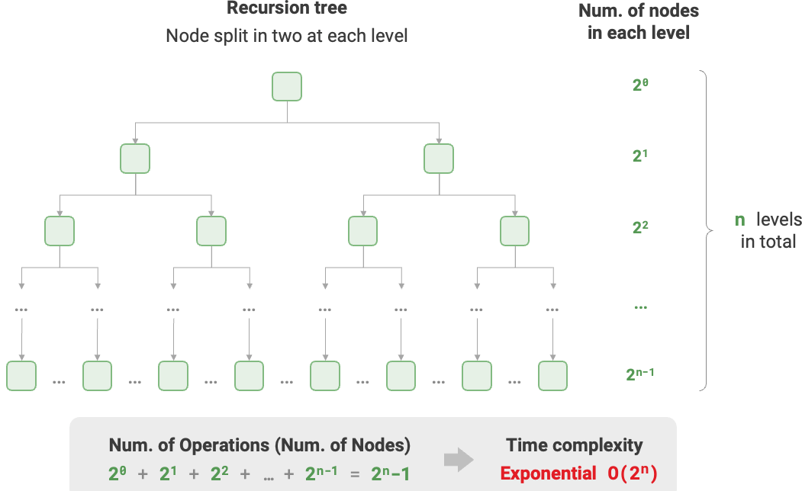
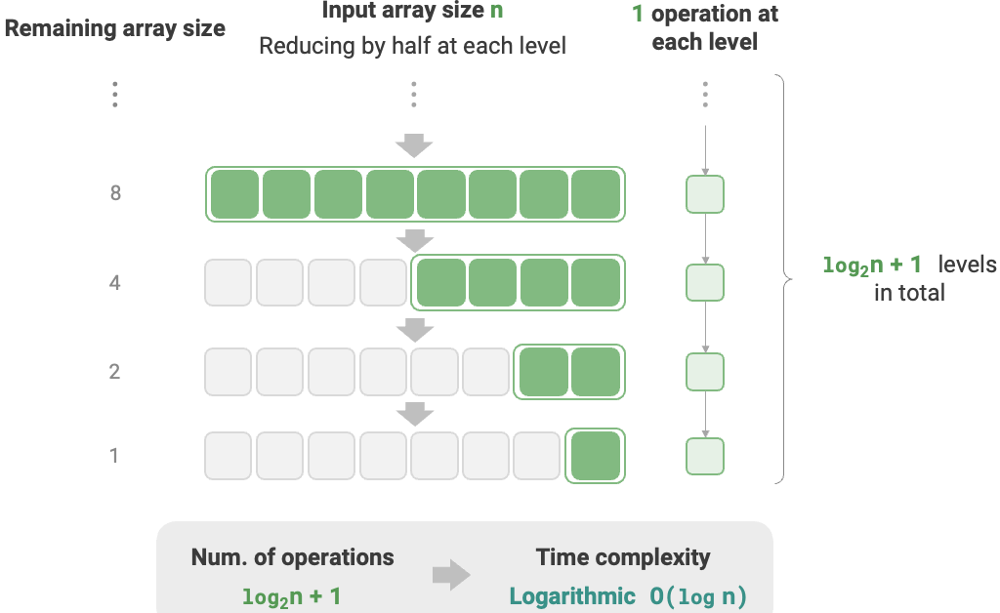
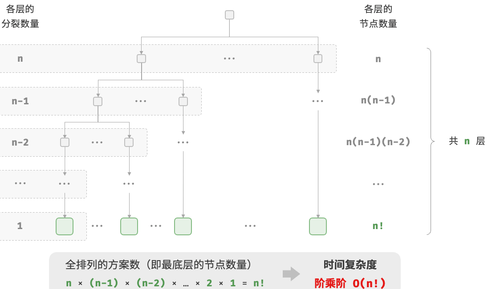
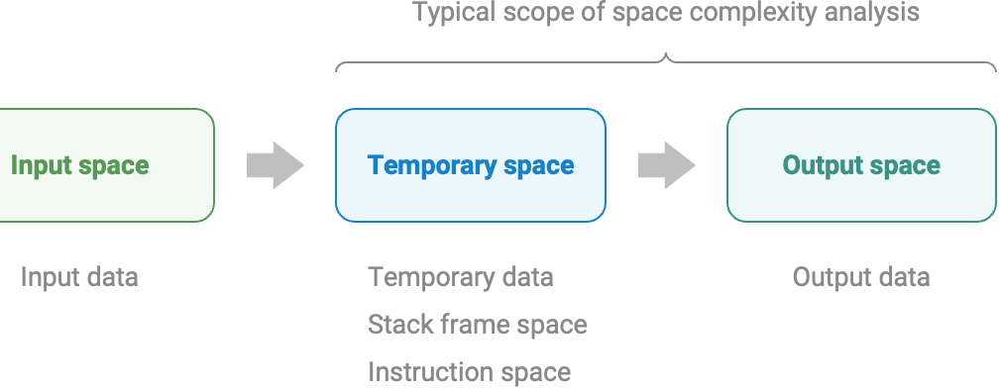
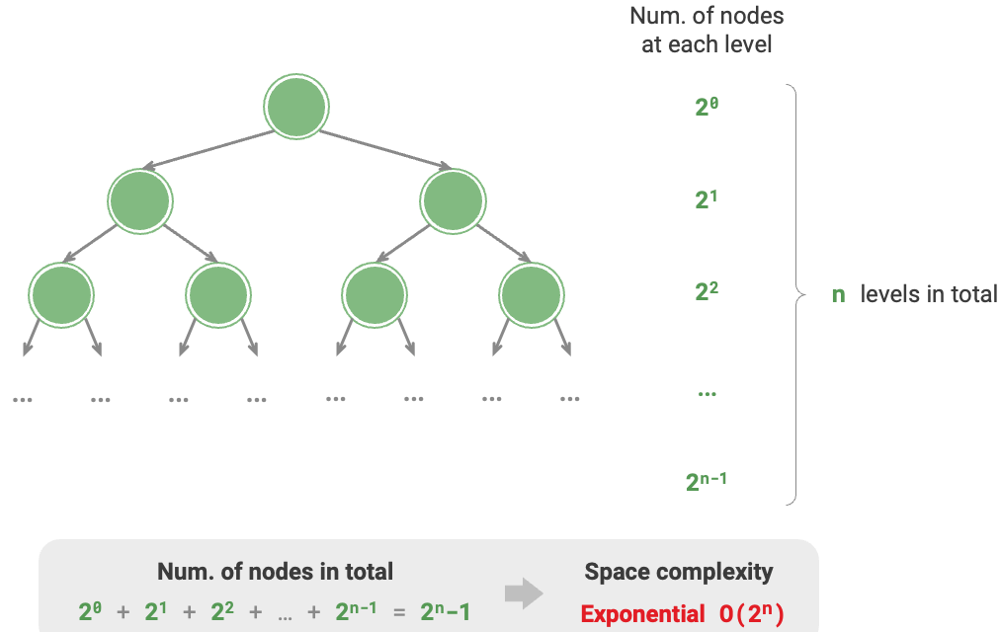

<h1 style="text-align: center;"><strong>Computational Complexity</strong></h1>

- [Time Complexity](#time-complexity)
  - [Exponential order 指数阶 $O(2^n)$](#exponential-order-指数阶-o2n)
  - [Logarithmic order 对数阶 $O(\\log n)$](#logarithmic-order-对数阶-olog-n)
  - [Linear-logarithmic order 线性对数阶 $O(n \\log n)$](#linear-logarithmic-order-线性对数阶-on-log-n)
  - [Factorial order 阶乘阶 $O(n!)$](#factorial-order-阶乘阶-on)
- [Space Complexity](#space-complexity)
  - [Exponential order 指数阶 $O(2^n)$](#exponential-order-指数阶-o2n-1)
  - [Logarithmic order 对数阶 $O(\\log n)$](#logarithmic-order-对数阶-olog-n-1)

<br></br>


# Time Complexity
The common types of time complexities are shown as below:

$$
\begin{aligned}
O(1) \text{常数} < O(\log n) \text{对数} < O(n) \text{线性} < O(n \log n) \text{线性对数} < O(n^2) \text{平方} < O(2^n) \text{指数} < O(n!) \text{阶乘}
\end{aligned}
$$

“最差时间复杂度”对应函数渐近上界，使用$O$表示；“最佳时间复杂度”对应函数渐近下界，用$\Omega$表示；“平均时间复杂度”可体现随机数据下效率，用$\Theta$表示。值得说明的是，实际中很少使用最佳时间复杂度，因为只在小概率下才达到，可能带来误导。而最差时间复杂度更实用，因为它给出效率安全值。

<br>


## Exponential order 指数阶 $O(2^n)$
Biological "cell division" is an example of exponential order growth: starting with one cell, it becomes two after one division, four after two divisions, and so on, resulting in  $2^n$ cells after n rounds of divisions.

```python
def exponential(n: int) -> int:
    count = 0
    base = 1
    # Cells split into two every round, forming the sequence 1, 2, 4, 8, ..., 2^(n-1)
    for _ in range(n):
        for _ in range(base):
            count += 1
        base *= 2
    # count = 1 + 2 + 4 + 8 + .. + 2^(n-1) = 2^n - 1
    return count
```



In practice, exponential order often appears in recursive functions. For example, in the code below, it recursively splits into two halves, stopping after n divisions:

```python
def exp_recur(n: int) -> int:
    if n == 1:
        return 1
    return exp_recur(n - 1) + exp_recur(n - 1) + 1
```

<br>


## Logarithmic order 对数阶 $O(\log n)$
In contrast to exponential order, logarithmic order reflects situations where "the size is halved each round." Given an input data size n
, since the size is halved each round, the number of iterations is $\log_2 n$.

```go
func logarithmic(n int) int {
    count := 0
    for n > 1 {
        n = n / 2
        count++
    }

    return count
}
```



Like exponential order, logarithmic order also frequently appears in recursive functions. The code below forms a recursive tree of height $\log_2 n$:

```go
func logRecur(n int) int {
    if n <= 1 {
        return 0
    }

    return logRecur(n/2) + 1
}
```

Logarithmic order is typical in algorithms based on divide-and-conquer strategy.

> $O(\log n)$底数是多少？准确来说，一分为$m$对应的时间复杂度是$O(\log_m n)$。而通过对数换底公式，可得到具有不同底数、相等的时间复杂度：
>    $$
>    O(\log_m n) = O(\log_k n / \log_k m) = O(\log_k n)
>    $$
> 也就是说，底数$m$可在不影响复杂度前提下转换。因此通常省略底数$m$，将对数阶直接记为$O(\log n)$。

<br>


## Linear-logarithmic order 线性对数阶 $O(n \log n)$
It often appears in nested loops嵌套循环, with the complexities of two loops being $O(\log n)$ and $O(n)$ respectively.

```go
func linearLogRecur(n int) int {
    if n <= 1 {
        return 1
    }

    count := linearLogRecur(n/2) + linearLogRecur(n/2)
    for i := 0; i < n; i++ {
        count++
    }

    return count
}
```

Below demonstrates how linear-logarithmic order is generated. Each level of a binary tree has n operations, and the tree has $\log_2 n + 1$ levels, resulting in time complexity of $O(n \log n)$.


<br>


## Factorial order 阶乘阶 $O(n!)$
It corresponds to the mathematical problem of "full permutation" 全排列. Given n distinct elements, the total number of possible permutations is $n!$.

$$
n! = n \times (n - 1) \times (n - 2) \times \dots \times 2 \times 1
$$

```go
func factorialRecur(n int) int {
    if n == 0 {
        return 1
    }

    count := 0
    for i := 0; i < n; i++ { // 从1个分裂出n个
        count += factorialRecur(n - 1)
    }

    return count
}
```



> 注意，因为当$n \geq 4$时恒有$n! > 2^n$，所以阶乘阶比指数阶增长更快，在$n$较大时不可接受。

<br></br>


# Space Complexity
算法运行中使用空间包括：
1. 输入空间Input space：存储算法输入数据。
2. 暂存空间Temporary space：存储运行中变量、对象、函数上下文等数据。
3. 输出空间Output space：存储输出数据。

一般情况，空间复杂度统计范围是“暂存空间”加上“输出空间”。暂存空间可进一步分为三个部分：
1. 暂存数据Temporary data：保存算法运行中常量、变量、对象等。
2. 栈帧空间Stack frame space：保存调用函数的上下文。系统每次调用函数时都会在栈顶创建一个栈帧，函数返回后，栈帧空间会释放。
3. 指令空间Instruction space：保存编译后的程序指令，实际统计中忽略不计。

```go
type node struct {
    val  int
    next *node
}

func newNode(val int) *node {
    return &node{val: val}
}

func function() int {
    // 执行某些操作...
    return 0
}

func algorithm(n int) int { // 输入数据
    const a = 0             // 暂存数据（常量）
    b := 0                  // 暂存数据（变量）
    newNode(0)              // 暂存数据（对象）
    c := function()         // 栈帧空间（调用函数）
    return a + b + c        // 输出数据
}
```

分析空间复杂度时，常统计暂存数据、栈帧空间和输出数据三部分，如图所示：



Unlike time complexity, we usually only focus on worst-case space complexity. Because memory space is a hard requirement, and we must ensure that there is enough space resource reserved for all input data.

<br>


## Exponential order 指数阶 $O(2^n)$
常见于二叉树。层数为$n$的满二叉树节点数为$2^n - 1$，占用$O(2^n)$空间：

```go
func buildTree(n int) *TreeNode {
    if n == 0 {
        return nil
    }

    root := NewTreeNode(0)
    root.Left = buildTree(n - 1)
    root.Right = buildTree(n - 1)

    return root
}
```



<br>


## Logarithmic order 对数阶 $O(\log n)$
常见于divide-and-conquer。举例：
* 归并排序。输入长为$n$数组，每轮递归将数组从中点分为两半，形成高度为$\log n$递归树，使用$O(\log n)$栈帧空间。
* 数字转为字符串。输入正整数$n$，它的位数为$\lfloor \log_{10} n \rfloor + 1$，即对应字符串长度为$\lfloor \log_{10} n \rfloor + 1$，因此空间复杂度为$O(\log_{10} n + 1) = O(\log n)$。
