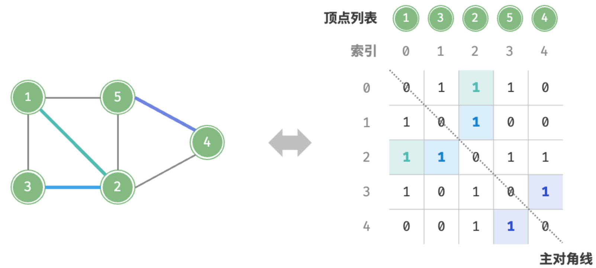
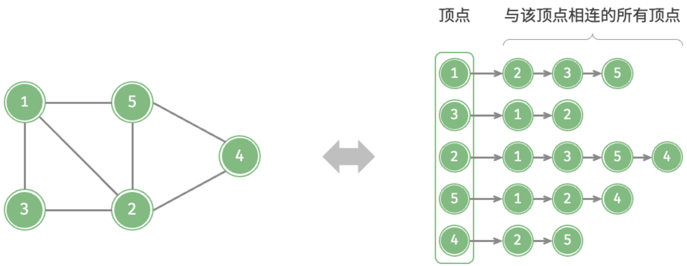

<h1 style="text-align: center;"><strong>Graph</strong></h1>

<br></br>


# 邻接矩阵 Adjacency Matrix


```go
type graphAdjMat struct {
    vertices []int // 顶点列表，元素代表“顶点值”，索引代表“顶点索引”
    adjMat [][]int // 邻接矩阵，行列索引对应“顶点索引”
}

func newGraphAdjMat(vertices []int, edges [][]int) *graphAdjMat {
    // 添加顶点
    n := len(vertices)
    adjMat := make([][]int, n)
    for i := range adjMat {
        adjMat[i] = make([]int, n)
    }
    // 初始化图
    g := &graphAdjMat{
        vertices: vertices,
        adjMat:   adjMat,
    }
    // 添加边
    for i := range edges {
        g.addEdge(edges[i][0], edges[i][1])
    }

    return g
}

func (g *graphAdjMat) addVertex(val int) {
    n := g.size()
    // 向顶点列表中添加新顶点的值
    g.vertices = append(g.vertices, val)
    // 在邻接矩阵中添加一行
    newRow := make([]int, n)
    g.adjMat = append(g.adjMat, newRow)
    // 在邻接矩阵中添加一列
    for i := range g.adjMat {
        g.adjMat[i] = append(g.adjMat[i], 0)
    }
}

func (g *graphAdjMat) removeVertex(index int) {
    if index >= g.size() {
        return
    }
    // 在顶点列表中移除索引 index 的顶点
    g.vertices = append(g.vertices[:index], g.vertices[index+1:]...)
    // 在邻接矩阵中删除索引 index 的行
    g.adjMat = append(g.adjMat[:index], g.adjMat[index+1:]...)
    // 在邻接矩阵中删除索引 index 的列
    for i := range g.adjMat {
        g.adjMat[i] = append(g.adjMat[i][:index], g.adjMat[i][index+1:]...)
    }
}

func (g *graphAdjMat) addEdge(i, j int) {
    if i < 0 || j < 0 || i >= g.size() || j >= g.size() || i == j {
        fmt.Errorf("%s", "Index Out Of Bounds Exception")
    }
    g.adjMat[i][j], g.adjMat[j][i] = 1, 1
}

func (g *graphAdjMat) removeEdge(i, j int) {
    if i < 0 || j < 0 || i >= g.size() || j >= g.size() || i == j {
        fmt.Errorf("%s", "Index Out Of Bounds Exception")
    }
    g.adjMat[i][j], g.adjMat[j][i] = 0, 0
}
```

<br></br>


# 邻接表 Adjacency List


```go
type graphAdjList struct {
    adjList map[Vertex][]Vertex
}

func newGraphAdjList(edges [][]Vertex) *graphAdjList {
    g := &graphAdjList{
        adjList: make(map[Vertex][]Vertex),
    }
    // 添加所有顶点和边
    for _, edge := range edges {
        g.addVertex(edge[0])
        g.addVertex(edge[1])
        g.addEdge(edge[0], edge[1])
    }

    return g
}

func (g *graphAdjList) addEdge(vet1 Vertex, vet2 Vertex) {
    _, ok1 := g.adjList[vet1]
    _, ok2 := g.adjList[vet2]
    if !ok1 || !ok2 || vet1 == vet2 {
        panic("error")
    }
    // 添加边 vet1 - vet2
    g.adjList[vet1] = append(g.adjList[vet1], vet2)
    g.adjList[vet2] = append(g.adjList[vet2], vet1)
}

func (g *graphAdjList) removeEdge(vet1 Vertex, vet2 Vertex) {
    _, ok1 := g.adjList[vet1]
    _, ok2 := g.adjList[vet2]
    if !ok1 || !ok2 || vet1 == vet2 {
        panic("error")
    }
    // 删除边 vet1 - vet2
    g.adjList[vet1] = DeleteSliceElms(g.adjList[vet1], vet2)
    g.adjList[vet2] = DeleteSliceElms(g.adjList[vet2], vet1)
}

func (g *graphAdjList) addVertex(vet Vertex) {
    _, ok := g.adjList[vet]
    if ok {
        return
    }
    // 在邻接表中添加一个新链表
    g.adjList[vet] = make([]Vertex, 0)
}

func (g *graphAdjList) removeVertex(vet Vertex) {
    _, ok := g.adjList[vet]
    if !ok {
        panic("error")
    }
    // 在邻接表中删除顶点 vet 对应的链表
    delete(g.adjList, vet)
    // 遍历其他顶点的链表，删除所有包含 vet 的边
    for v, list := range g.adjList {
        g.adjList[v] = DeleteSliceElms(list, vet)
    }
}
```

<br></br>


# Traversal
## BFS
* 时间复杂度：所有顶点会入队并出队一次，使用$O(|V|)$时间；遍历邻接顶点过程中，由于是无向图，所有边都会访问2次，使用$O(2|E|)$时间；总体使用$O(|V| + |E|)$时间。
* 空间复杂度：列表`res`，哈希`visited`，队列`que`中顶点数量最多为$|V|$，使用$O(|V|)$空间。

```go
func graphBFS(g *graphAdjList, startVet Vertex) []Vertex {
    res := make([]Vertex, 0)
    visited := make(map[Vertex]struct{})
    visited[startVet] = struct{}{}
    queue := make([]Vertex, 0)
    queue = append(queue, startVet)
    for len(queue) > 0 {
        vet := queue[0]
        queue = queue[1:]
        res = append(res, vet)
        for _, adjVet := range g.adjList[vet] {
            _, isExist := visited[adjVet]
            if !isExist {
                queue = append(queue, adjVet)
                visited[adjVet] = struct{}{}
            }
        }
    }

    return res
}
```

<br>


## DFS
* 时间复杂度：所有顶点会访问1次，使用$O(|V|)$时间；所有边会访问2次，使用$O(2|E|)$时间；总体使用$O(|V| + |E|)$时间。
* 空间复杂度：列表 `res`，哈希`visited`顶点数量最多为$|V|$，递归深度最大为$|V|$，使用$O(|V|)$空间。

```go
func dfs(g *graphAdjList, visited map[Vertex]struct{}, res *[]Vertex, vet Vertex) {
    *res = append(*res, vet) // append 操作会返回新的的引用，必须让原引用重新赋值为新slice的引用
    visited[vet] = struct{}{}
    for _, adjVet := range g.adjList[vet] {
        _, isExist := visited[adjVet]
        if !isExist {
            dfs(g, visited, res, adjVet)
        }
    }
}

func graphDFS(g *graphAdjList, startVet Vertex) []Vertex {
    res := make([]Vertex, 0)
    visited := make(map[Vertex]struct{})
    dfs(g, visited, &res, startVet)

    return res
}
```