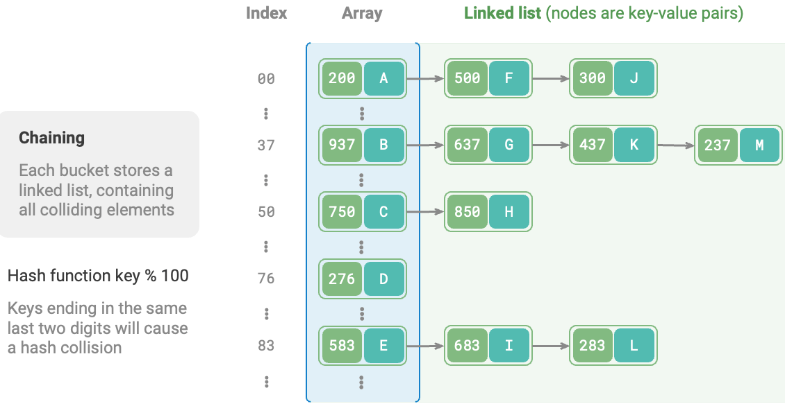
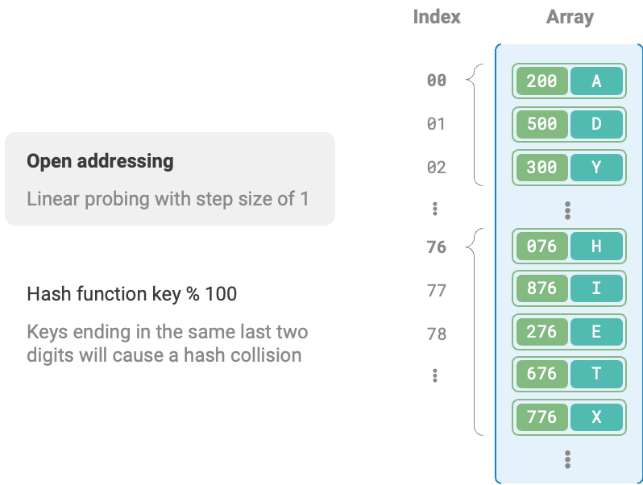
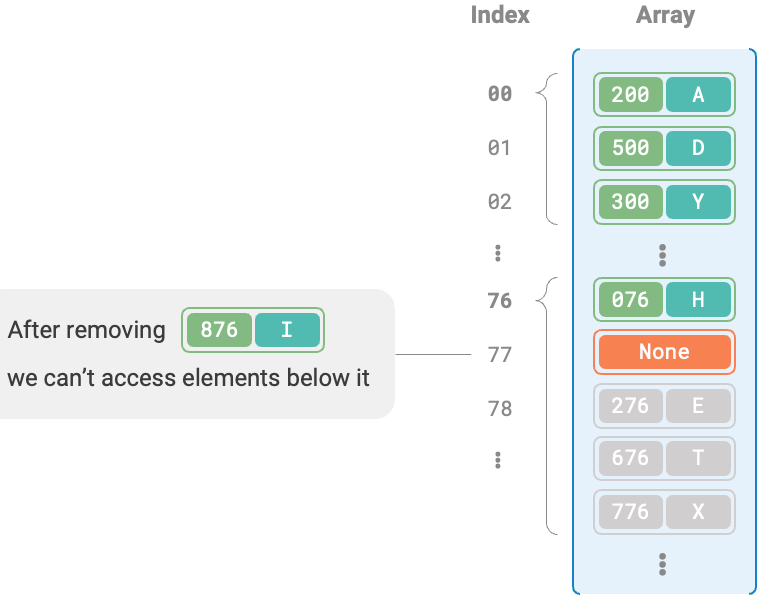

<h1 style="text-align: center;"><strong>Hash</strong></h1>

<br></br>


# Hash Collision
* Python采用开放寻址。字典dict使用伪随机数进行探测。
* Java采用链式地址。自JDK 1.8，当HashMap内数组长度达到64且链表长度达到8时，链表会转为红黑树以提升性能。
* Go采用链式地址。规定每个桶最多存储8个键值对，超出容量则连接一个溢出桶；当溢出桶过多时，会执行特殊的等量扩容操作，以确保性能。

<br>


## 链式地址 Separate Chaining


When the linked list is very long, the query efficiency $O(n)$ is poor. In this case, the list can be converted to AVL tree or Red-Black tree to optimize time complexity to $O(\log n)$.

The following includes a hash table resizing method. When the load factor exceeds $2/3$, we expand the hash table to twice its original size.

```go
type hashMapChaining struct {
    size        int      // 键值对数量
    capacity    int      // 哈希表容量
    loadThres   float64  // 触发扩容的负载因子阈值
    extendRatio int      // 扩容倍数
    buckets     [][]pair // 桶数组
}

/* 哈希函数 */
func (m *hashMapChaining) hashFunc(key int) int {
    return key % m.capacity
}

/* 负载因子 */
func (m *hashMapChaining) loadFactor() float64 {
    return float64(m.size) / float64(m.capacity)
}

func (m *hashMapChaining) get(key int) string {
    idx := m.hashFunc(key)
    bucket := m.buckets[idx]
    // 遍历桶，若找到 key ，则返回对应 val
    for _, p := range bucket {
        if p.key == key {
            return p.val
        }
    }
    // 若未找到 key ，则返回空字符串
    return ""
}

/* 添加操作 */
func (m *hashMapChaining) put(key int, val string) {
    // 当负载因子超过阈值时，执行扩容
    if m.loadFactor() > m.loadThres {
        m.extend()
    }
    idx := m.hashFunc(key)
    // 遍历桶，若遇到指定 key ，则更新对应 val 并返回
    for i := range m.buckets[idx] {
        if m.buckets[idx][i].key == key {
            m.buckets[idx][i].val = val
            return
        }
    }
    // 若无该 key ，则将键值对添加至尾部
    p := pair{
        key: key,
        val: val,
    }
    m.buckets[idx] = append(m.buckets[idx], p)
    m.size += 1
}

/* 删除操作 */
func (m *hashMapChaining) remove(key int) {
    idx := m.hashFunc(key)
    // 遍历桶，从中删除键值对
    for i, p := range m.buckets[idx] {
        if p.key == key {
            // 切片删除
            m.buckets[idx] = append(m.buckets[idx][:i], m.buckets[idx][i+1:]...)
            m.size -= 1
            break
        }
    }
}

/* 扩容哈希表 */
func (m *hashMapChaining) extend() {
    // 暂存原哈希表
    tmpBuckets := make([][]pair, len(m.buckets))
    for i := 0; i < len(m.buckets); i++ {
        tmpBuckets[i] = make([]pair, len(m.buckets[i]))
        copy(tmpBuckets[i], m.buckets[i])
    }
    // 初始化扩容后的新哈希表
    m.capacity *= m.extendRatio
    m.buckets = make([][]pair, m.capacity)
    for i := 0; i < m.capacity; i++ {
        m.buckets[i] = make([]pair, 0)
    }
    m.size = 0
    // 将键值对从原哈希表搬运至新哈希表
    for _, bucket := range tmpBuckets {
        for _, p := range bucket {
            m.put(p.key, p.val)
        }
    }
}
```

<br>


## 开放寻址 Open Addressing
### 线性探测 Linear Probing
采用固定步长的线性搜索进行探测：
* 插入：通过哈希函数计算桶索引，若桶内已有元素，则从冲突位置向后线性遍历（步长通常为1），直至找到空桶，将元素插入其中。
* 查找：若哈希冲突，则使用相同步长向后线性遍历，直到找到。如果遇到空桶，说明目标不在哈希表。



不能在开放寻址哈希表中直接删除元素。因为删除元素会在数组内产生空桶，当查询时，线性探测到空桶就会返回。因此在该空桶之下的元素都无法再被访问，从而造成误判。



为解决问题，可采用lazy deletion：不直接从哈希表中移除元素，而是利用一个常量`TOMBSTONE`标记这个桶。在该机制下，`None`和`TOMBSTONE`都代表空桶，都可放置键值对。但不同的是，线性探测到`TOMBSTONE`时继续遍历。

然而，懒删除可能加速哈希表性能退化。因为每次删除操作都会产生一个删除标记，随着`TOMBSTONE`增加，搜索时间也会增加。为此，可在线性探测中记录遇到的首个`TOMBSTONE`的索引，并将搜索到的目标与该`TOMBSTONE`交换位置。这样每次查询或添加时，元素会被移至距理想位置（探测起始点）更近的桶，从而优化效率。

```go
/* 开放寻址哈希表 */
type hashMapOpenAddressing struct {
    size        int     // 键值对数量
    capacity    int     // 哈希表容量
    loadThres   float64 // 触发扩容的负载因子阈值
    extendRatio int     // 扩容倍数
    buckets     []*pair // 桶数组
    TOMBSTONE   *pair   // 删除标记
}

/* 哈希函数 */
func (h *hashMapOpenAddressing) hashFunc(key int) int {
    return key % h.capacity // 根据键计算哈希值
}

/* 负载因子 */
func (h *hashMapOpenAddressing) loadFactor() float64 {
    return float64(h.size) / float64(h.capacity) // 计算当前负载因子
}

/* 搜索 key 对应的桶索引 */
func (h *hashMapOpenAddressing) findBucket(key int) int {
    index := h.hashFunc(key) // 获取初始索引
    firstTombstone := -1     // 记录遇到的第一个TOMBSTONE的位置
    for h.buckets[index] != nil {
        if h.buckets[index].key == key {
            if firstTombstone != -1 {
                // 若之前遇到了删除标记，则将键值对移动至该索引处
                h.buckets[firstTombstone] = h.buckets[index]
                h.buckets[index] = h.TOMBSTONE
                return firstTombstone // 返回移动后的桶索引
            }
            return index // 返回找到的索引
        }
        if firstTombstone == -1 && h.buckets[index] == h.TOMBSTONE {
            firstTombstone = index // 记录遇到的首个删除标记的位置
        }
        index = (index + 1) % h.capacity // 线性探测，越过尾部则返回头部
    }
    // 若 key 不存在，则返回添加点的索引
    if firstTombstone != -1 {
        return firstTombstone
    }
    return index
}

/* 查询操作 */
func (h *hashMapOpenAddressing) get(key int) string {
    index := h.findBucket(key) // 搜索 key 对应的桶索引
    if h.buckets[index] != nil && h.buckets[index] != h.TOMBSTONE {
        return h.buckets[index].val // 若找到键值对，则返回对应 val
    }
    return "" // 若键值对不存在，则返回 ""
}

/* 添加操作 */
func (h *hashMapOpenAddressing) put(key int, val string) {
    if h.loadFactor() > h.loadThres {
        h.extend() // 当负载因子超过阈值时，执行扩容
    }
    index := h.findBucket(key) // 搜索 key 对应的桶索引
    if h.buckets[index] == nil || h.buckets[index] == h.TOMBSTONE {
        h.buckets[index] = &pair{key, val} // 若键值对不存在，则添加该键值对
        h.size++
    } else {
        h.buckets[index].val = val // 若找到键值对，则覆盖 val
    }
}

/* 删除操作 */
func (h *hashMapOpenAddressing) remove(key int) {
    index := h.findBucket(key) // 搜索 key 对应的桶索引
    if h.buckets[index] != nil && h.buckets[index] != h.TOMBSTONE {
        h.buckets[index] = h.TOMBSTONE // 若找到键值对，则用删除标记覆盖它
        h.size--
    }
}

/* 扩容哈希表 */
func (h *hashMapOpenAddressing) extend() {
    oldBuckets := h.buckets               // 暂存原哈希表
    h.capacity *= h.extendRatio           // 更新容量
    h.buckets = make([]*pair, h.capacity) // 初始化扩容后的新哈希表
    h.size = 0                            // 重置大小
    // 将键值对从原哈希表搬运至新哈希表
    for _, pair := range oldBuckets {
        if pair != nil && pair != h.TOMBSTONE {
            h.put(pair.key, pair.val)
        }
    }
}
```

<br>


### 平方探测 Quadratic Probing
发生冲突时，平方探测跳过探测次数的平方的步数，即$1, 4, 9, \dots$步。

<br>


### 多次哈希 Double Hashing
多次哈希方法使用多个哈希函数$f_1(x)$、$f_2(x)$、$f_3(x)$、$\dots$进行探测。

多次哈希是开放寻址的一种，**开放寻址法都有不能直接删除元素的缺陷**，需通过标记删除。

<br></br>


# Hash Algorithms
To achieve fast and stable data structure, hash algorithms should meet:
1. 确定性 Determinism: For the same input, it should always produce the same output.
2. Efficiency
3. 均匀分布Uniform distribution

Some simple hash algorithms.
* Additive 加法 - 对输入的每个字符ASCII码相加，总和作为哈希值。

    ```go
    func addHash(key string) int {
        var hash, modulus int64
        modulus = 1000000007
        for _, b := range []byte(key) {
            hash = (hash + int64(b)) % modulus
        }
        return int(hash)
    }
    ```

* Multiplicative 乘法 - 利用乘法的不相关性，每轮乘以一个常数，将各字符ASCII码累积到哈希值中。

    ```go
    func mulHash(key string) int {
        var hash, modulus int64
        modulus = 1000000007
        for _, b := range []byte(key) {
            hash = (31*hash + int64(b)) % modulus
        }
        return int(hash)
    }
    ```

* XOR 异或 - 将输入数据的每个元素通过异或操作累积到哈希值。

    ```go
    func xorHash(key string) int {
        hash := 0
        modulus := 1000000007
        for _, b := range []byte(key) {
            hash ^= int(b)
            hash = (31*hash + int(b)) % modulus
        }
        return hash & modulus
    }   
    ```

* Rotating 旋转 - 将每个字符ASCII码累积到一个哈希值中，每次累积前都对哈希值进行旋转操作。

    ```go
    func rotHash(key string) int {
        var hash, modulus int64
        modulus = 1000000007
        for _, b := range []byte(key) {
            hash = ((hash << 4) ^ (hash >> 28) ^ int64(b)) % modulus
        }
        return int(hash)
    }
    ```

使用大质数prime numbe作为模数modulus，可以最大化地保证哈希值的均匀分布。因为质数不与其他数字存在公约数，可以减少因取模操作而产生的周期性模式，从而避免哈希冲突。

假设选择$9$作为模数，它可被$3$整除，那么所有可被$3$整除的`key`都会被映射到$0$、$3$、$6$这三个哈希值。如果输入`key`满足这种等差数列分布，那么哈希值会出现聚堆。假设将`modulus`换为质数$13$，由于`key`和`modulus`之间不存在公约数，因此哈希值均匀性提升。


<br></br>


# References
* [Hello Algorithm](https://www.hello-algo.com/chapter_hashing/hash_map/)