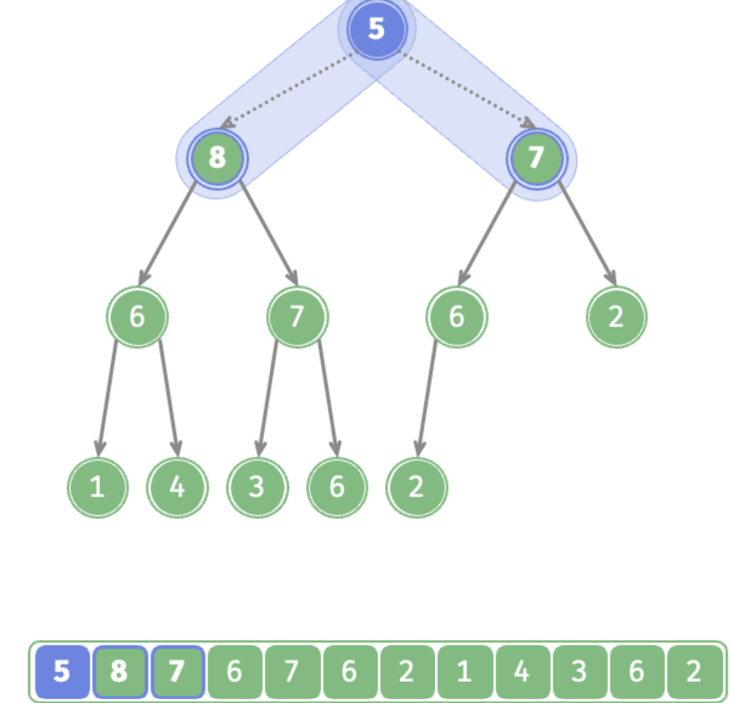

<h1 style="text-align: center;"><strong>Heap</strong></h1>

<br></br>


# What
| Method   | Time complexity |
| -------- | --------------- |
| `push()` | $O(\log n)$     |
| `pop()`  | $O(\log n)$     |

<br></br>


# 常见操作
## 存储与表示
堆是完全二叉树，因此采用数组存储。

```go
// 获取左子节点索引
func (h *maxHeap) left(i int) int {
    return 2*i + 1
}

// 获取右子节点索引
func (h *maxHeap) right(i int) int {
    return 2*i + 2
}

// 获取父节点索引
func (h *maxHeap) parent(i int) int {
    return (i - 1) / 2 // 向下整除
}
```

<br>


## 访问堆顶元素
```go
func (h *maxHeap) top() int {
    return h.data[0]
}
```

<br>


## 插入元素
给定元素`val`，先添加到堆底。由于`val`可能大于堆中其他元素，需修复从插入节点到根节点路径上各个节点，这个操作称为堆化（heapify）。

从入堆节点开始，从底至顶执行堆化。依次比较插入节点与父节点值，如果插入节点大，则交换。以此类推，从底至顶修复各节点，直至越过根节点或遇到无须交换的节点时结束。


```go
func (h *maxHeap) push(val any) {
    h.data = append(h.data, val) // 添加节点
    h.siftUp(len(h.data) - 1) // 从底至顶堆化
}

// 从节点i开始，从底至顶堆化
func (h *maxHeap) siftUp(i int) {
    for true {
        p := h.parent(i) // 获取节点i父节点
        if p < 0 || h.data[i].(int) <= h.data[p].(int) {
            break // 当越过根节点或节点无须修复时，结束堆化
        }
        h.swap(i, p)
        i = p // 循环向上堆化
    }
}
```

<br>


## 弹出元素
堆顶元素是二叉树根节点，即列表首元素。如果直接从列表中删除首元素，所有节点索引会发生变化，使得后续使用堆化进行修复变得困难。为减少元素索引变动，采用以下步骤：
1. 交换堆顶与堆底元素（根节点与最右叶节点）。
2. 将堆底从列表中删除。
3. 从根节点开始，从顶至底执行堆化。

从顶至底堆化的操作方向与从底至顶堆化相反，将根节点值与两个子节点比较，将最大的子节点与根节点交换。循环往复，直到越过叶节点或遇到无须交换的子节点时结束。





```go
func (h *maxHeap) pop() any {
    if h.isEmpty() {
        return nil
    }
    
    h.swap(0, h.size()-1) // 交换根节点与最右叶节点（交换首尾元素）
    // 删除节点
    val := h.data[len(h.data)-1]
    h.data = h.data[:len(h.data)-1]
    // 从顶至底堆化
    h.siftDown(0)

    return val
}

// 从节点i开始，从顶至底堆化
func (h *maxHeap) siftDown(i int) {
    for true {
        // 判断节点i, l, r中值最大的节点，记为max
        l, r, max := h.left(i), h.right(i), i
        if l < h.size() && h.data[l].(int) > h.data[max].(int) {
            max = l
        }
        if r < h.size() && h.data[r].(int) > h.data[max].(int) {
            max = r
        }
        // 若节点i最大或索引l, r越界，则无须继续堆化，跳出
        if max == i {
            break
        }
        h.swap(i, max)
        i = max // 循环向下堆化
    }
}
```

<br></br>


# 建堆
Let the number of elements be $n$, and each element's insertion operation takes $O(\log{n})$ time, thus the time complexity of heap construction is $O(n \log n)$.

更高效的建堆方法，分为两步：
1. 将所有元素原封不动地添加到堆中。
2. 倒序遍历堆（层序遍历的倒序），依次对每个非叶节点执行从顶至底堆化。

每当堆化一个节点后，以该节点为根节点的子树形成一个合法的子堆。由于倒序遍历，因此堆是自下而上构建。之所以倒序，因为能保证当前节点之下子树是合法子堆，这样堆化当前节点才是有效的。由于叶节点没有子节点，因此它们天然是合法子堆，无须堆化。

```go
func newMaxHeap(nums []any) *maxHeap {
    h := &maxHeap{data: nums} // 将列表元素原封不动添加进堆
    for i := h.parent(len(h.data) - 1); i >= 0; i-- {
        h.siftDown(i) // 堆化除叶节点外所有节点
    }
    return h
}
```

复杂度分析：
- Assuming the number of nodes is $n$, then the number of leaf nodes is $(n + 1) / 2$. Therefore, the number of nodes that need to be heapified is $(n - 1) / 2$.
- In the process of top to bottom heapification, each node is heapified to the leaf nodes at most, so the max number of iterations is the height of tree $\log n$.
- Multiplying the two, we get the time complexity as $O(n \log n)$. But this estimate is not accurate, because it does not take into account the nature of binary tree having far more nodes at lower levels than top.

假设给定一个节点数量为n、高度为h的完美二叉树。节点从顶至底堆化最大迭代数等于该节点到叶节点距离。因此，对各层节点数量 $\times$ 节点高度求和，得到所有节点堆化迭代次数总和。


$$
T(h) = 2^0h + 2^1(h-1) + 2^2(h-2) + \dots + 2^{(h-1)}\times1
$$

化简上式先将 $T(h)$ 乘以 $2$ ，得：

$$
\begin{aligned}
T(h) & = 2^0h + 2^1(h-1) + 2^2(h-2) + \dots + 2^{h-1}\times1 \newline
2 T(h) & = 2^1h + 2^2(h-1) + 2^3(h-2) + \dots + 2^{h}\times1 \newline
\end{aligned}
$$

使用错位相减法，用下式 $2 T(h)$ 减去上式 $T(h)$ ，得：

$$
2T(h) - T(h) = T(h) = -2^0h + 2^1 + 2^2 + \dots + 2^{h-1} + 2^h
$$

发现 $T(h)$ 是等比数列，使用求和公式，得：

$$
\begin{aligned}
T(h) & = 2 \frac{1 - 2^h}{1 - 2} - h \newline
& = 2^{h+1} - h - 2 \newline
& = O(2^h)
\end{aligned}
$$

进一步，高度为 $h$ 的完美二叉树节点数量为 $n = 2^{h+1} - 1$ ，得复杂度为 $O(2^h) = O(n)$ 。以上推算表明，时间复杂度为 $O(n)$。

<br></br>


# Top-k问题
算法：
1. 初始化小顶堆，堆顶元素最小。
2. 将数组的前k个元素依次入堆。
3. 从第k+1个元素开始，若当前元素大于堆顶元素，则将堆顶元素出堆，并将当前元素入堆。
4. 遍历完成后，堆中保存的就是最大的k个元素。

```go
func topKHeap(nums []int, k int) *minHeap {
    h := &minHeap{} // 初始化小顶堆
    heap.Init(h)
    // 将前k个元素入堆
    for i := 0; i < k; i++ {
        heap.Push(h, nums[i])
    }
    // 从第k+1个开始，保持堆长度为k
    for i := k; i < len(nums); i++ {
        // 若当前元素大于堆顶元素，则将堆顶元素出堆、当前元素入堆
        if nums[i] > h.Top().(int) {
            heap.Pop(h)
            heap.Push(h, nums[i])
        }
    }
    
    return h
}
```