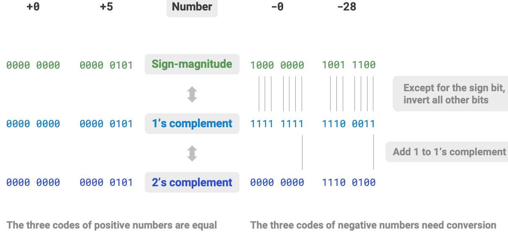
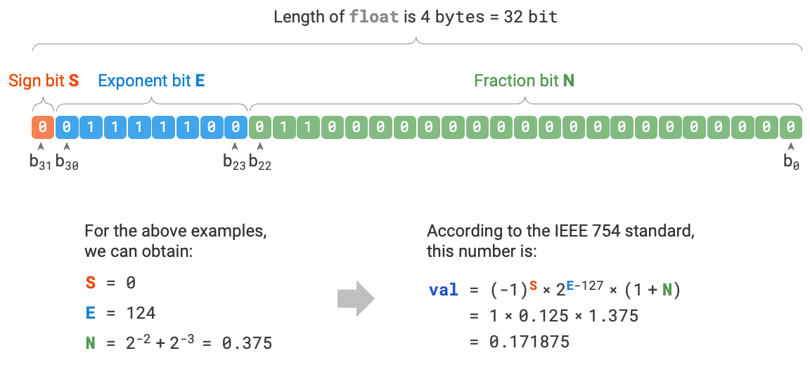

<h1 style="text-align: center;"><strong>Numerical Encoding</strong></h1>

- [整数编码 Integer Encoding - 原码/反码/补码 Sign-magnitude/One's complement/Two's complement](#整数编码-integer-encoding---原码反码补码-sign-magnitudeones-complementtwos-complement)
  - [负数运算](#负数运算)
- [浮点数编码](#浮点数编码)

<br></br>


# 整数编码 Integer Encoding - 原码/反码/补码 Sign-magnitude/One's complement/Two's complement
首先，**数字是以补码形式存储在计算机中**。。

- **原码 Sign-magnitude**：将数字二进制表示的最高位视为符号位，其中$0$表示正数，$1$表示负数，其余位表示数字值。The highest bit of a binary representation of a number is considered as sign bit, where 0 represents a positive number and 1 represents a negative number. The remaining bits represent the value of the number.

    表示方法：符号位加上真值的绝对值，即第一位表示符号，其余表示值。

    比如8位二进制：
    * [+1]原 = 0000 0001
    * [-1]原 = 1000 0001

- **反码 One's complement**：正数的反码与其原码相同，负数的反码是对其原码除符号位外的所有位取反。The one's complement of a positive number is the same as its sign-magnitude. For negative numbers, it's obtained by inverting all bits except the sign bit.

    表示方法
    1. 正数反码是其本身。
    2. 负数反码是在其原码基础上，符号位不，其余各位取反.

    比如：
    * [+1] = [00000001]原 = [00000001]反
    * [-1] = [10000001]原 = [11111110]反

- **补码 Two's complement**：正数的补码与其原码相同，负数的补码是在其反码的基础上加$1$ 。The two's complement of a positive number is the same as its sign-magnitude. For negative numbers, it's obtained by adding 1 to their one's complement.

    表示方法：
    1. 正数补码是本身。
    2. 负数补码是在原码基础上，符号位不变，其余各位取反，最后+1。即在反码基础上+1。

    比如：
    * [+1] = [00000001]原 = [00000001]反 = [00000001]补
    * [-1] = [10000001]原 = [11111110]反 = [11111111]补



原码（sign-magnitude）虽然最直观，但存在局限性。一方面，负数原码不能直接用于运算。例如在原码下计算$1 + (-2)$，得到的结果是$-3$。

$$
\begin{aligned}
& 1 + (-2) \newline
& \rightarrow 0000 \; 0001 + 1000 \; 0010 \newline
& = 1000 \; 0011 \newline
& \rightarrow -3
\end{aligned}
$$

为解决此问题，引入反码（One's complement）。如果先将原码转为反码，并在反码下计算$1 + (-2)$，最后将结果从反码转回原码，则可得正确结果$-1$。

$$
\begin{aligned}
& 1 + (-2) \newline
& \rightarrow 0000 \; 0001 \; \text{(Sign-magnitude)} + 1000 \; 0010 \; \text{(Sign-magnitude)} \newline
& = 0000 \; 0001 \; \text{(One's complement)} + 1111  \; 1101 \; \text{(One's complement)} \newline
& = 1111 \; 1110 \; \text{(One's complement)} \newline
& = 1000 \; 0001 \; \text{(Sign-magnitude)} \newline
& \rightarrow -1
\end{aligned}
$$

另一方面，数字零的原码有$+0$和$-0$两种表示方式，意味数字零对应两个不同二进制编码，会带来歧义。比如在条件判断中，如果没有区分正零和负零，则可能导致判断出错。如果想处理正零和负零，需引入额外判断操作，降低效率。

$$
\begin{aligned}
+0 & \rightarrow 0000 \; 0000 \newline
-0 & \rightarrow 1000 \; 0000
\end{aligned}
$$

与原码一样，反码也存在正负零问题，因此引入补码（Two's complement）。先观察负零原码、反码、补码转换过程：

$$
\begin{aligned}
-0 \rightarrow \; & 1000 \; 0000 \; \text{(Sign-magnitude)} \newline
= \; & 1111 \; 1111 \; \text{(One's complement)} \newline
= 1 \; & 0000 \; 0000 \; \text{(Two's complement)} \newline
\end{aligned}
$$

在负零反码基础上加$1$会产生进位carry，但 `byte` 类型长度只有8位，因此溢出到第9位的$1$会被舍弃。也就是说，负零补码为$0000 \; 0000$，与正零补码相同。意味在补码表示中只存在一个零，正负零得到解决。

最后一个疑惑，`byte`取值范围是$[-128, 127]$，多出来的一个负数$-128$是如何得到的呢？注意到，区间$[-127, +127]$内所有整数都有对应的原码、反码和补码，且原码和补码可互相转换。然而，补码$1000 \; 0000$例外，它没有对应的原码。根据转换方法，得到该补码原码为$0000 \; 0000$。这是矛盾的，因为该原码表示$0$，它的补码应是自身。于是，规定这个特殊的补码$1000 \; 0000$代表 $-128$。实际上，$(-1) + (-127)$在补码下的结果就是$-128$。

$$
\begin{aligned}
& (-127) + (-1) \newline
& \rightarrow 1111 \; 1111 \; \text{(Sign-magnitude)} + 1000 \; 0001 \; \text{(Sign-magnitude)} \newline
& = 1000 \; 0000 \; \text{(One's complement)} + 1111  \; 1110 \; \text{(One's complement)} \newline
& = 1000 \; 0001 \; \text{(Two's complement)} + 1111  \; 1111 \; \text{(Two's complement)} \newline
& = 1000 \; 0000 \; \text{(Two's complement)} \newline
& \rightarrow -128
\end{aligned}
$$

请注意，上述所有计算都是加法，即**计算机内部硬件电路主要是基于加法运算设计，通过将加法与一些基本逻辑运算结合，实现其他运算**。现在可总结使用补码原因：基于补码表示，可用同样电路和操作处理正负数加法，且无须特别处理正负零问题。

<br>


## 负数运算
将符号位参与运算，且只保留加法的方法。先看原码：

```
1 – 1 = 1 + (-1) = [00000001]原 + [10000001]原 = [10000010]原 = -2
```

如果用原码，让符号位也参与计算，减法结果是不正确的。为解决原码减法问题，出现了反码：

```
1 – 1 = 1 + (-1) = [0000 0001]原 + [1000 0001]原= [0000 0001]反 + [1111 1110]反 = [1111 1111]反 = [1000 0000]原 = -0
```

用反码计算减法，结果真值部分正确，但会有`[0000 0000]原`和`[1000 0000]原`两个编码表示0.于是补码出现，解决0符号及两个编码问题：

```
1 – 1 = 1 + (-1) = [0000 0001]原 + [1000 0001]原 = [0000 0001]补 + [1111 1111]补 = [0000 0000]补 = [0000 0000]原
```

这样0用`[0000 0000]`表示，而以前出现问题的`-0`则不存在，且可用`[1000 0000]`表示-128。

使用补码，一是为防止0有2个编码，其次把减法用加法表示，达到简化电路作用，且还能多表示一个最低数。这就是为什么8位二进制，原码或反码表示范围为`[-127, +127]`，而补码表示范围为`[-128, 127]`。

<br></br>


# 浮点数编码
`int` 和 `float`长度相同，都是4字节，但`float`范围远大于`int`。因为浮点数采用不同表示方式。记一个32比特长度二进制数为：

$$
b_{31} b_{30} b_{29} \ldots b_2 b_1 b_0
$$

根据IEEE 754标准，32-bit长度`float`由三部分构成：

1. Sign Bit符号位$\mathrm{S}$：占1位，对应$b_{31}$。
2. Exponent Bit指数位$\mathrm{E}$：占8位，对应$b_{30} b_{29} \ldots b_{23}$。
3. Fraction Bit分数位$\mathrm{N}$：占23位，对应$b_{22} b_{21} \ldots b_0$。

二进制数`float`对应值的计算方法为：

$$
\text {val} = (-1)^{b_{31}} \times 2^{\left(b_{30} b_{29} \ldots b_{23}\right)_2-127} \times\left(1 . b_{22} b_{21} \ldots b_0\right)_2
$$

转化到十进制decimal formula下的计算公式为：

$$
\text {val}=(-1)^{\mathrm{S}} \times 2^{\mathrm{E} -127} \times (1 + \mathrm{N})
$$

其中各项取值范围为：

$$
\begin{aligned}
\mathrm{S} \in & \{ 0, 1\}, \quad \mathrm{E} \in \{ 1, 2, \dots, 254 \} \newline
(1 + \mathrm{N}) = & (1 + \sum_{i=1}^{23} b_{23-i} 2^{-i}) \subset [1, 2 - 2^{-23}]
\end{aligned}
$$



根据上图，给定示例数据$\mathrm{S} = 0$，$\mathrm{E} = 124$，$\mathrm{N} = 2^{-2} + 2^{-3} = 0.375$，有：

$$
\text { val } = (-1)^0 \times 2^{124 - 127} \times (1 + 0.375) = 0.171875
$$

现在可回答最初问题：因为`float`表示方式包含指数位，导致其范围大于`int`。根据以上计算，`float`可表示最大正数为$2^{254 - 127} \times (2 - 2^{-23}) \approx 3.4 \times 10^{38}$，切换符号位可得最小负数。

尽管浮点数扩展取值范围，但副作用是牺牲精度。`int`将32比特用于表示数字，数字均匀分布；由于指数位存在，`float`数值越大，相邻两个数字间差值会越大。However, the trade-off for `float`'s expanded range is a sacrifice in precision. `int` uses all 32 bits to represent number, with values evenly distributed; due to the exponent bit, the larger the value of a `float`, the greater the difference between adjacent numbers.

Exponent bits  $\mathrm{E} = 0$ and $\mathrm{E} = 255$ have special meanings, used to represent zero, infinity无穷大, $\mathrm{NaN}$, etc.


| 指数位  E           | 分数位 $\mathrm{N} = 0$ | 分数位 $\mathrm{N} \ne 0$ | 计算公式                                                               |
| ------------------ | ----------------------- | ------------------------- | ---------------------------------------------------------------------- |
| $0$                | $\pm 0$                 | 次正规数                  | $(-1)^{\mathrm{S}} \times 2^{-126} \times (0.\mathrm{N})$              |
| $1, 2, \dots, 254$ | 正规数                  | 正规数                    | $(-1)^{\mathrm{S}} \times 2^{(\mathrm{E} -127)} \times (1.\mathrm{N})$ |
| $255$              | $\pm \infty$            | $\mathrm{NaN}$            |                                                                        |

次正规数subnormal numbers提升浮点数精度。最小正正规数positive normal number为$2^{-126}$ ，最小正次正规数为$2^{-126} \times 2^{-23}$。
