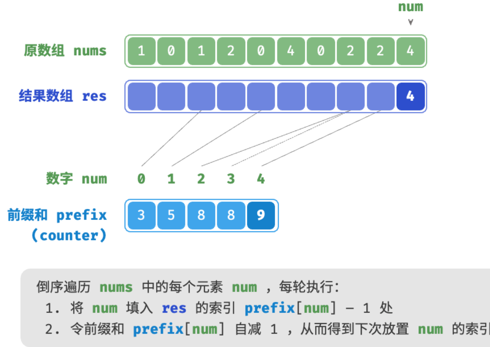

<h1 style="text-align: center;"><strong>Sort</strong></h1>

- [Selection Sort](#selection-sort)
- [Bubble Sort](#bubble-sort)
  - [效率优化](#效率优化)
- [Insertion Sort](#insertion-sort)
  - [插入排序优势](#插入排序优势)
- [Quick Sort](#quick-sort)
  - [基准数优化](#基准数优化)
  - [尾递归优化](#尾递归优化)
- [Merge Sort](#merge-sort)
- [Heap Sort](#heap-sort)
- [Bucket Sort](#bucket-sort)
  - [实现平均分配桶](#实现平均分配桶)
- [Counting Sort](#counting-sort)
  - [完整实现](#完整实现)

<br></br>


# Selection Sort
开启一个循环，每轮从未排序区间选择最小元素，将其放到已排序区间末尾。

1. 初始状态，所有元素未排序，即未排序（索引）区间为$[0, n-1]$。
2. 选取区间$[0, n-1]$最小元素，将其与$0$处元素交换。完成后，数组前1个元素已排序。
3. 选取区间$[1, n-1]$最小元素，将其与$1$处元素交换。完成后，数组前2个元素已排序。
4. 以此类推。经过$n - 1$轮，前$n - 1$个元素已排序。
5. 仅剩元素必是最大元素，无须排序。


```go
func selectionSort(nums []int) {
    n := len(nums)
    // 外循环：未排序区间为 [i, n-1]
    for i := 0; i < n-1; i++ {
        // 内循环：找到未排序区间内的最小元素
        k := i
        for j := i + 1; j < n; j++ {
            if nums[j] < nums[k] {
                k = j // 记录最小元素的索引
            }
        }
        nums[i], nums[k] = nums[k], nums[i] // 将该最小元素与未排序区间的首个元素交换

    }
}
```

- 时间复杂度为$O(n^2)、非自适应排序：外循环$n - 1$轮，第一轮未排序区间长度为$n$，最后一轮未排序区间长度为$2$，即各轮外循环分别包含$n$、$n - 1$、$\dots$、$3$、$2$轮内循环，求和为$\frac{(n - 1)(n + 2)}{2}$。
- 空间复杂度为$O(1)$、原地排序
- 非稳定排序：如下图所示，`nums[i]`可能被交换至与其相等的元素右边，导致两者相对顺序改变。


<br></br>


# Bubble Sort
通过连续比较与交换相邻元素实现排序：
1. 首先，对$n$个元素执行“冒泡”，将最大元素交换至正确位置。
2. 接下来，对剩余$n - 1$个元素执行“冒泡”，将第二大元素交换至正确位置。
3. 以此类推，经过$n - 1$轮后，前$n - 1$大的元素都被交换至正确位置。
4. 仅剩的元素必是最小元素，无须排序。


```go
func bubbleSort(nums []int) {
    // 外循环：未排序区间为 [0, i]
    for i := len(nums) - 1; i > 0; i-- {
        // 内循环：将未排序区间 [0, i] 中的最大元素交换至该区间的最右端
        for j := 0; j < i; j++ {
            if nums[j] > nums[j+1] {
                nums[j], nums[j+1] = nums[j+1], nums[j] // 交换 nums[j] 与 nums[j + 1]
            }
        }
    }
}
```

- 时间复杂度$O(n^2)$、自适应排序：各轮“冒泡”遍历的数组长度依次为$n - 1$、$n - 2$、$\dots$、$2$、$1$，总和为$(n - 1) n / 2$。引入`flag`优化后，最佳时间复杂度可达$O(n)$。
- **空间复杂度为 $O(1)$、原地排序**：指针 $i$ 和 $j$ 使用常数大小的额外空间。
- **稳定排序**：由于在“冒泡”中遇到相等元素不交换。

<br>


## 效率优化
如果某轮“冒泡”中没有执行交换操作，说明已完成排序。因此，增加标志位`flag`监测这种情况。经过优化，最差时间复杂度和平均时间复杂度仍为$O(n^2)$；但当数组有序时，可达到最佳时间复杂度$O(n)$。

<br></br>


# Insertion Sort
在未排序区间选择一个基准元素，将该元素与已排序区间元素逐一比较，并将该元素插入到正确位置。。

1. 初始状态，第1个元素已完成排序。
2. 选取第2个元素作为`base`，插入到正确位置后，前2个元素已排序。
3. 选取第3个元素作为`base`，插入到正确位置后，前3个元素已排序。
4. 以此类推，最后一轮选取最后一个元素作为`base`，插入到正确位置后，所有元素均已排序。


```go
func insertionSort(nums []int) {
    // 外循环：已排序区间为 [0, i-1]
    for i := 1; i < len(nums); i++ {
        base := nums[i]
        j := i - 1
        // 内循环：将 base 插入到已排序区间 [0, i-1] 中的正确位置
        for j >= 0 && nums[j] > base {
            nums[j+1] = nums[j] // 将 nums[j] 向右移动一位
            j--
        }
        nums[j+1] = base // 将 base 赋值到正确位置
    }
}
```

- 时间复杂度为$O(n^2)、自适应排序：最差情况每次插入操作分别需循环$n - 1$、$n-2$、$\dots$、$2$、$1$次，求和得$(n - 1) n / 2$，因此时间复杂度为$O(n^2)$。遇到有序数据时，插入操作提前终止。当输入数组完全有序时，达到最佳时间复杂度$O(n)$。
- 空间复杂度$O(1)$、原地排序
- 稳定排序：插入操作过程中，会将元素插入到相等元素右侧，不会改变它们顺序。

<br>


## 插入排序优势
虽然插入排序时间复杂度为$O(n^2)$，而快排时间复杂度为$O(n \log n)$，但在数据量较小情况下，插入排序更快。因为快排这类$O(n \log n)$算法属于分治策略，往往包含更多单元计算操作。在数据量较小时，$n^2$和$n \log n$数值接近，复杂度不占主导地位，每轮单元操作数起决定性作用。

实际上，许多编程语言的内置排序函数采用插入排序，大致思路为
- 对于长数组，采用基于分治策略的排序算法，如快速排序
- 对于短数组，直接使用插入排序。

插入排序的使用频率高于冒泡和选择排序，因为：
- 冒泡排序基于元素交换，需借助临时变量，涉及3个单元操作；插入排序基于元素赋值，仅需1个单元操作。因此，冒泡排序计算开销比插入排序高。
- 选择排序在任何情况下的时间复杂度都为$O(n^2)$。如果给定部分有序数据，插入排序效率更高。此外，选择排序不稳定，无法用于多级排序。

<br></br>


# Quick Sort
基于分治策略的排序算法。核心操作是“哨兵划分”，目标是选择某个元素作为基准数，将小于基准数的元素移到左侧，而大于基准数的元素移到右侧。

1. 首先，对原数组执行一次哨兵划分，得到未排序的左右子数组。
2. 对左右子数组分别递归执行哨兵划分。
3. 持续递归，直至子数组长度为1时终止。


- 时间复杂度为$O(n \log n)、非自适应排序：平均情况下，哨兵划分递归层数为$\log n$，每层中总循环数为$n$，总体使用$O(n \log n)$时间。最差情况下，每轮哨兵划分操作都将长度为$n$的数组划分为长度为$0$和$n - 1$子数组，此时递归层数达到$n$，每层循环数为$n$，总体使用$O(n^2)$时间。
- 空间复杂度为$O(n)$、原地排序：在完全倒序情况，达到最差递归深度$n$。
- 非稳定排序：在哨兵划分的后一步，基准数可能会交换至相等元素右侧。

尽管快排平均时间复杂度与归并和堆排序相同，但快排效率更高，因为：
- 出现最差情况概率低：虽然快排最差时间复杂度没归并排序稳定，但在多数情况，快排能在$O(n \log n)$时间复杂度下运行。
- 缓存效率高：执行哨兵划分时，系统可将整个子数组加载到缓存，因此访问元素效率高。而堆排序这类算法需跳跃式访问元素。
- 复杂度的常数系数小：三种算法中，快排的比较、赋值、交换等操作总数量最少。这与插入排序比冒泡排序更快的原因类似。

<br>


## 基准数优化
快排在某些输入下的时间效率可能降低。假设完全倒序，由于选择最左端作为基准数，在哨兵划分后，基准数交换至最右端，导致左子数组长度为$n - 1$、右子数组长度为$0$。如此递归，每轮哨兵划分后都有一个子数组长度为$0$，分治策略失效，快排退化为冒泡排序近似形式。

为避免这种情况，可以优化哨兵划分中的基准数选取策略。如，可随机选取元素作为基准数。

<br>


## 尾递归优化
在某些输入下，快排占用空间多。以完全有序输入为例，设递归中子数组长度为$m$，每轮哨兵划分都将产生长为$0$左子数组和$m - 1$右子数组，意味着每层递归调用减少的问题规模非常小（只减少一个元素），递归树高度达到$n - 1$，需$O(n)$栈帧空间。

可在每轮哨兵排序后，比较两个子数组长度，仅对较短子数组递归。由于较短子数组长度不会超过$n / 2$，因此能确保递归深度不超过$\log n$，从而将最差空间复杂度优化至$O(\log n)$。

<br></br>


# Merge Sort
基于分治策略的排序算法，包含下图所示的“划分”和“合并”阶段。

1. 划分：递归不断将数组从中点分开，将长数组排序问题转为短数组排序问题。
    1. 计算数组中点`mid`，递归划分左子数组（`[left, mid]`）和右子数组（`[mid + 1, right]`）。
    2. 递归执行步骤`1.`，直至子数组区间长度为1时终止。
2. 合并：从底至顶地将左右子数组合并为一个有序数组。注意，从长度为1的子数组开始合并，合并阶段中每个子数组都是有序的。


> 归并排序与二叉树后序遍历递归顺序一致：
> - 后序遍历：先递归左子树，再递归右子树，最后处理根节点。
> - 归并排序：先递归左子数组，再递归右子数组，最后处理合并。

```go
func merge(nums []int, left, mid, right int) {
    // 左子数组区间为 [left, mid], 右子数组区间为 [mid+1, right]
    // 创建一个临时数组 tmp ，用于存放合并后的结果
    tmp := make([]int, right-left+1)
    i, j, k := left, mid+1, 0 // 初始化左子数组和右子数组的起始索引
    // 当左右子数组都还有元素时，进行比较并将较小的元素复制到临时数组中
    for i <= mid && j <= right {
        if nums[i] <= nums[j] {
            tmp[k] = nums[i]
            i++
        } else {
            tmp[k] = nums[j]
            j++
        }
        k++
    }
    // 将左子数组和右子数组的剩余元素复制到临时数组中
    for i <= mid {
        tmp[k] = nums[i]
        i++
        k++
    }
    for j <= right {
        tmp[k] = nums[j]
        j++
        k++
    }
    // 将临时数组 tmp 中的元素复制回原数组 nums 的对应区间
    for k := 0; k < len(tmp); k++ {
        nums[left+k] = tmp[k]
    }
}

func mergeSort(nums []int, left, right int) {
    if left >= right { // 终止条件
        return
    }
    // 划分阶段
    mid := left + (right - left) / 2
    mergeSort(nums, left, mid)
    mergeSort(nums, mid+1, right)
    // 合并阶段
    merge(nums, left, mid, right)
}
```

<br></br>


# Heap Sort
设数组的长度为n：
1. 输入数组并建立大顶堆。
2. 将堆顶元素（第一个元素）与堆底元素（最后一个元素）交换。完成交换后，堆的长度减1，已排序元素数量加1。
3. 从堆顶元素开始，从顶到底执行堆化操作（sift down）。完成堆化后，堆的性质得到修复。
4. 循环执行第2和第3步。循环n-1轮完成排序。


```go
// 堆的长度为n，从节点i开始，从顶至底堆化
func siftDown(nums *[]int, n, i int) {
    for true {
        // 判断节点 i, l, r 中值最大的节点，记为 ma
        l, r, ma := 2*i + 1, 2*i + 2, i
        if l < n && (*nums)[l] > (*nums)[ma] {
            ma = l
        }
        if r < n && (*nums)[r] > (*nums)[ma] {
            ma = r
        }
        // 若节点 i 最大或索引 l, r 越界，则无须继续堆化，跳出
        if ma == i {
            break
        }
        // 交换两节点
        (*nums)[i], (*nums)[ma] = (*nums)[ma], (*nums)[i]
        // 循环向下堆化
        i = ma
    }
}

func heapSort(nums *[]int) {
    // 建堆操作：堆化除叶节点以外的其他所有节点
    for i := len(*nums)/2 - 1; i >= 0; i-- {
        siftDown(nums, len(*nums), i)
    }
    // 从堆中提取最大元素，循环n-1轮
    for i := len(*nums) - 1; i > 0; i-- {
        // 交换根节点与最右叶节点（交换首元素与尾元素）
        (*nums)[0], (*nums)[i] = (*nums)[i], (*nums)[0]
        // 以根节点为起点，从顶至底进行堆化
        siftDown(nums, i, 0)
    }
}
```

- 时间复杂度$O(n \log n)$、非自适应排序：建堆使用$O(n)$时间。从堆提取最大元素时间复杂度为$O(\log n)$，循环$n - 1$轮。
- 空间复杂度$O(1)$、原地排序
- 非稳定排序：在交换堆顶和堆底元素时，相等元素相对位置可能发生变化。

<br></br>


# Bucket Sort
前述排序属于“基于比较”，此类算法时间复杂度无法超越$O(n \log n)$。桶排序属于“非比较排序算法”，时间复杂度可达到线性阶。它是分治策略的应用。通过设置有大小顺序的桶，每个桶对应一个数据范围，将数据平均分配到各个桶中，然后，在每个桶内部排序，最终按照桶顺序合并。

考虑长$n$数组，其元素是$[0, 1)$内的浮点数。桶排序流程如下：
1. 初始化$k$个桶，将$n$个元素分配到$k$个桶中。
2. 对每个桶排序。
3. 按照桶从小到大顺序合并。

！[](./Images/bucket_sort.png)

```go
func bucketSort(nums []float64) {
    k := len(nums) / 2 // 初始化 k = n/2 个桶，预期向每个桶分配 2 个元素
    buckets := make([][]float64, k)
    for i := 0; i < k; i++ {
        buckets[i] = make([]float64, 0)
    }
    // 1. 将数组元素分配到各个桶中
    for _, num := range nums {
        i := int(num * float64(k)) // 输入数据范围为 [0, 1)，使用 num * k 映射到索引范围 [0, k-1]
        buckets[i] = append(buckets[i], num) // 将 num 添加进桶 i
    }
    // 2. 对各个桶执行排序
    for i := 0; i < k; i++ {
        sort.Float64s(buckets[i]) // 使用内置切片排序函数，也可以替换成其他排序算法
    }
    // 3. 遍历桶合并结果
    i := 0
    for _, bucket := range buckets {
        for _, num := range bucket {
            nums[i] = num
            i++
        }
    }
}
```

桶排序适用体量很大的数据。例如，数据含100万个元素，内存无法一次加载所有数据。可将数据分成1000个桶，分别对每个桶排序，最后将结果合并。

- 时间复杂度平均$O(n + k)$，最差$O(n^2)$：假设元素在各个桶内平均分布，那么每个桶内元素数量为$\frac{n}{k}$。假设排序单个桶使用$O(\frac{n}{k} \log\frac{n}{k})$，则排序所有桶使用$O(n \log\frac{n}{k})$。当桶数量$k$较大，时间复杂度趋于$O(n)$。合并结果时需遍历所有桶和元素，花费$O(n + k)$时间。最差情况，所有数据分配到一个桶，且排序该桶使用$O(n^2)$时间。
- 空间复杂度为O(n + k)$、非原地排序：需借助$k$个桶和共$n$个元素额外空间。
- 是否稳定取决于排序桶内元素算法是否稳定。

<br>


## 实现平均分配桶
时间复杂度理论上可达到$O(n)$，关键在于将元素均匀分配到各个桶。为实现平均分配，可先设定大致分界线，将数据粗略分到3个桶。分配完毕后，再将元素较多的桶继续分为3个桶，直至所有桶中的元素数量大致相等。本质上是创建一棵递归树，让叶节点值尽可能平均。

<br></br>


# Counting Sort
计数排序通过统计元素数量实现排序，常应用于整数数组。

给定长为$n$的数组`nums`，其中元素都是非负整数，流程为：
1. 遍历数组，找出最大数字，记为$m$。创建长为$m + 1$的辅助数组`counter`。
2. 借助`counter`统计 `nums`中各数字的出现次数，其中`counter[num]`对应数字`num`出现次数。
3. 由于`counter`各个索引天然有序，因此相当于所有数字已排序。遍历`counter`，根据各数字出现次数从小到大顺序填入`nums`即可。


```go
func countingSortNaive(nums []int) {
    // 1. 统计数组最大元素 m
    m := 0
    for _, num := range nums {
        if num > m {
            m = num
        }
    }
    // 2. 统计各数字的出现次数
    counter := make([]int, m+1) // counter[num] 代表 num 的出现次数
    for _, num := range nums {
        counter[num]++
    }
    // 3. 遍历 counter ，将各元素填入原数组 nums
    for i, num := 0, 0; num < m+1; num++ {
        for j := 0; j < counter[num]; j++ {
            nums[i] = num
            i++
        }
    }
}
```

<br>


## 完整实现
如果输入数据是对象，步骤`3.`会失效。为此，首先计算`counter`前缀和，即索引`i`处的前缀和，`prefix[i]`等于前`i`个元素和：

$$
\text{prefix}[i] = \sum_{j=0}^i \text{counter[j]}
$$

前缀和有明确的意义，`prefix[num] - 1`代表`num`在结果数组`res`最后一次出现的索引。它告诉我们各元素应出现在结果数组哪个位置。接下来，倒序遍历原数组`nums`每个元素`num`，在每轮迭代中执行以下两步：
1. 将`num`填入`res`索引`prefix[num] - 1`处。
2. 令前缀和`prefix[num]`减小1，从而得到下次放置`num`的索引。

遍历完后，`res`是排序好的结果，最后使用`res`覆盖`nums`即可。





```go
func countingSort(nums []int) {
    // 1. 统计数组最大元素 m
    m := 0
    for _, num := range nums {
        if num > m {
            m = num
        }
    }
    // 2. 统计各数字的出现次数
    counter := make([]int, m+1) // counter[num] 代表 num 的出现次数
    for _, num := range nums {
        counter[num]++
    }
    // 3. 求counter前缀和，将出现次数转为尾索引，即counter[num]-1是num在res中最后一次出现的索引
    for i := 0; i < m; i++ {
        counter[i+1] += counter[i]
    }
    // 4. 倒序遍历 nums ，将各元素填入结果数组 res
    n := len(nums)
    res := make([]int, n) // 初始化数组 res 用于记录结果
    for i := n - 1; i >= 0; i-- {
        num := nums[i]
        res[counter[num]-1] = num // 将 num 放置到对应索引处
        counter[num]-- // 令前缀和自减 1 ，得到下次放置 num 的索引
    }
    copy(nums, res) // 使用结果数组 res 覆盖原数组 nums
}
```

- 时间复杂度$O(n + m)$、非自适应排序：涉及遍历`nums`和`counter`，都使用线性时间。一般情况下$n \gg m$，时间复杂度趋于$O(n)$。
- 空间复杂度$O(n + m)$、非原地排序：借助长为$n$和$m$的数组`res`和`counter`。
- 稳定排序：由于向`res`填充元素顺序是从右向左，因此倒序遍历`nums`可避免改变相等元素相对位置。实际上，正序遍历`nums`也可得到排序结果，但非稳定。

局限性：
- 计数排序只适用非负整数。若用于其他数据，需确保数据可转为非负整数，且在转换过程中不改变各元素间相对大小关系。
- 计数排序适用于数据量大但数据范围较小的情况。如在上述示例中$m$不能太大，否则占用过多空间。而当$n \ll m$时，计数排序使用$O(m)$时间，可能比$O(n \log n)$慢。