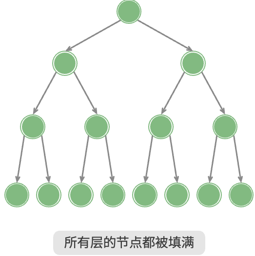
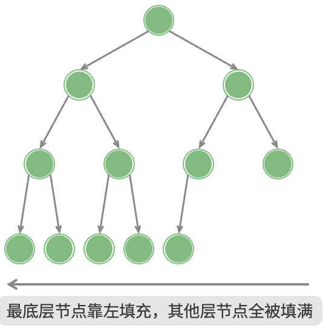
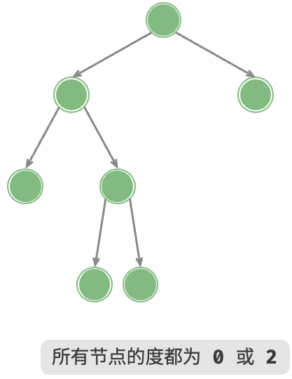
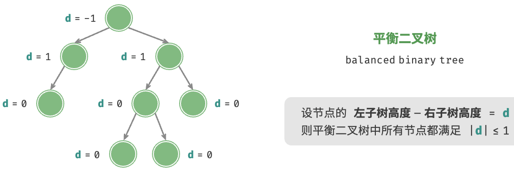
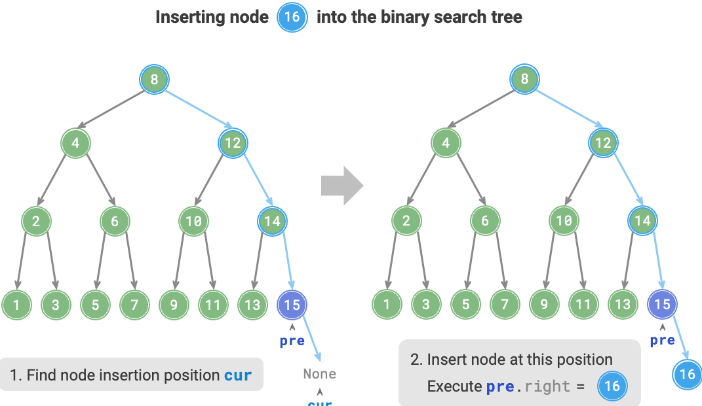
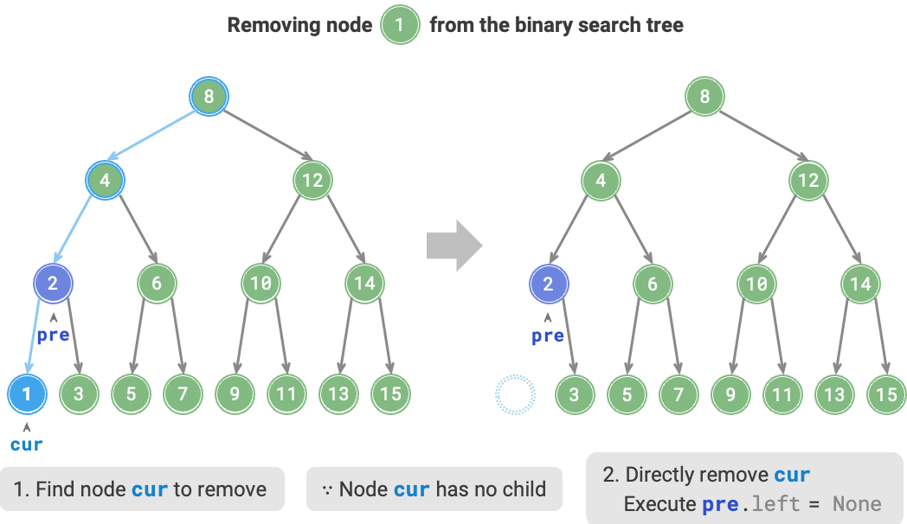
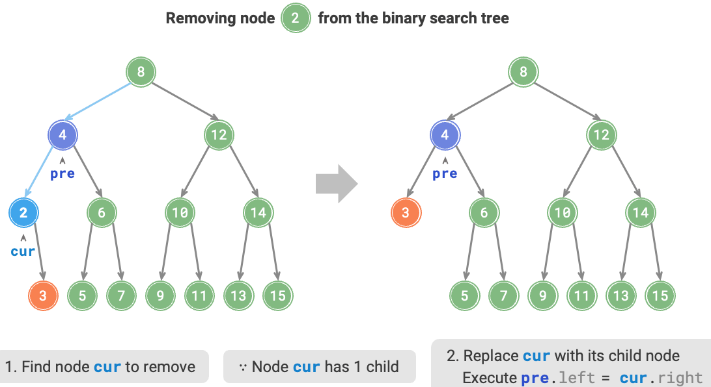
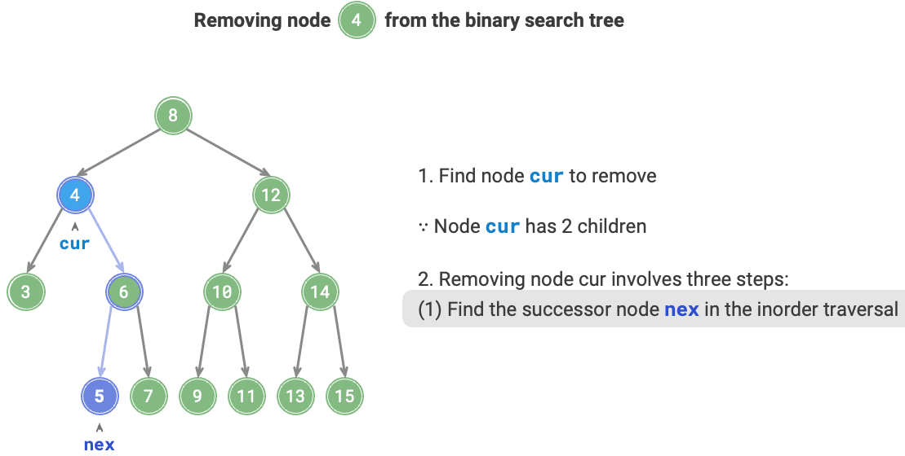
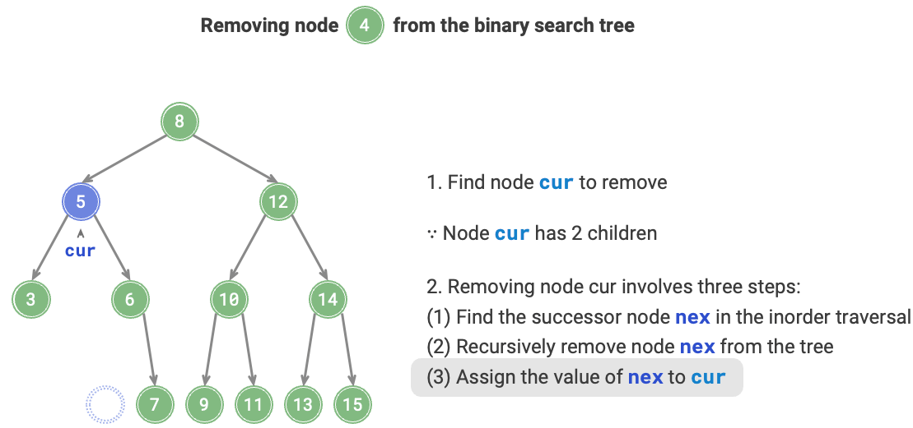

<h1 style="text-align: center;"><strong>Tree</strong></h1>

<br></br>


# 二叉树类型
* 完美二叉树/满二叉树 perfect binary tree：所有层节点都填满。叶节点的度为$0$，其余节点度都为$2$。若树高度为$h$，则节点数为$2^{h+1} - 1$>。

    

* 完全二叉树 complete binary tree：只有底层节点未被填满，且底层节点尽量靠左填充。完美二叉树也是完全二叉树。

    

* 完满二叉树 full binary tree：除叶节点外，其余所有节点都有两个子节点。

    

* 平衡二叉树 balanced binary tree：the absolute difference in height between the left and right subtrees of any node does not exceed 1.

    

<br></br>


# 二叉搜索树
## 插入节点
插入新值选择在空余叶节点：



<br>


## 删除节点
删除节点分三种情况：
1. 无子节点：表示该节点是叶节点，直接删除。

    

2. 有一个子节点：删除节点，将子节点连接到父节点。

    

3. 有两个子节点：找到右子树的最小节点（即目标节点的中序遍历下一个节点），替换当前节点，然后删除右子树的最小节点（即中序遍历下一个节点）。

    
    

```go
func (bst *binarySearchTree) remove(num int) {
    cur := bst.root
    // 若树为空，直接提前返回
    if cur == nil {
        return
    }
    // 待删除节点之前的节点位置
    var pre *TreeNode = nil
    // 循环查找，越过叶节点后跳出
    for cur != nil {
        if cur.Val == num {
            break
        }
        pre = cur
        if cur.Val.(int) < num {
            cur = cur.Right // 待删除节点在右子树中
        } else {
            cur = cur.Left // 待删除节点在左子树中
        }
    }
    // 若无待删除节点，则直接返回
    if cur == nil {
        return
    }
    // 子节点数为 0 或 1
    if cur.Left == nil || cur.Right == nil {
        var child *TreeNode = nil
        // 取出待删除节点的子节点
        if cur.Left != nil {
            child = cur.Left
        } else {
            child = cur.Right
        }
        // 删除节点 cur
        if cur != bst.root {
            if pre.Left == cur {
                pre.Left = child
            } else {
                pre.Right = child
            }
        } else {
            bst.root = child // 若删除节点为根节点，则重新指定根节点
        }
    // 子节点数为 2
    } else {
        // 获取中序遍历中待删除节点 cur 的下一个节点
        tmp := cur.Right
        for tmp.Left != nil {
            tmp = tmp.Left
        }
        bst.remove(tmp.Val.(int)) // 递归删除节点 tmp
        cur.Val = tmp.Val // 用 tmp 覆盖 cur
    }
}
```

<br></br>


