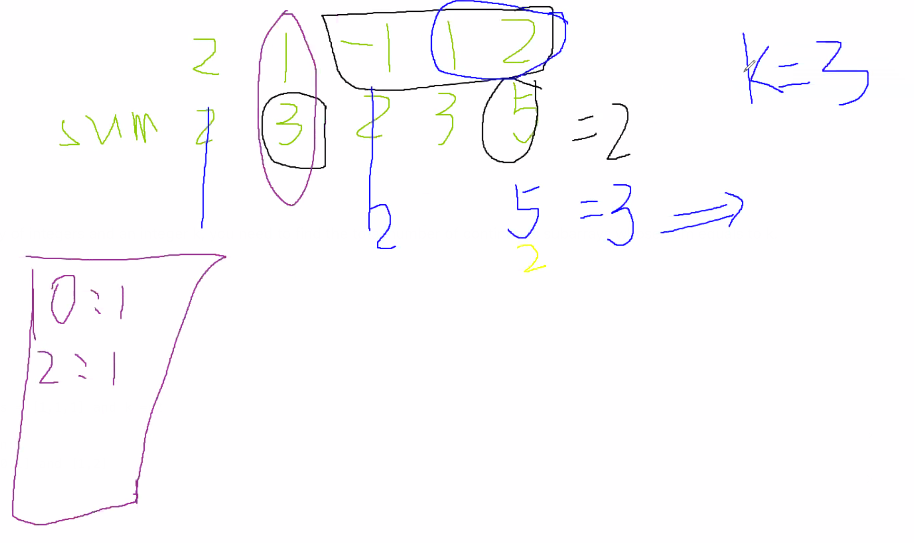

# <center>560 - Subarray Sum Equals K (M)</center> 


<br></br>

* Tag: Slip Window, Hash, Array
* Difficulty: Medium
* Company: Google, Facebook
* Link: https://leetcode.com/problems/subarray-sum-equals-k/

<br></br>


## Description
----
Given an array of integers and an integer k, you need to find the total number of continuous subarrays whose sum equals to k.

<br></br>


## Example
----
Input:nums = [1,1,1], k = 2
Output: 2

<br></br>


## Solution
----
算法：（设`nums = [2,1,-1,1,2]`和`k = 3`）
1. 思想是利用一个哈希表保存从0开始到各个位置的子数组和。对于`k`，假如`nums[i]-k`存在与哈希表中，那么说明存在这种“拼接”。
2. 遍历`nums`，并且每个位置记录累加和，得`nums = [2,3,2,3,5]`。
3. 初始化哈希表，设`m = {0:1}`，该元素表示当前单独元素或者前面累加和为0的子数组。
4. 遍历`nums`：
	1. 对`nums[0] = 2`，因为`nums[0] - k = -1`，在哈希表中不存在。记录当前子数组和出现次数，即`m = {0:1, 2:1}`。
	2. 对`nums[1] = 3`，因为`nums[1] - k = 0`，在哈希表中存在，即找到一个符合条件的子数组，统计+1，并记录当前子数组和出现次数，得`m = {0:1, 2:1, 3:1}`。
	3. 对`nums[2] = 2`，因为`nums[2] - k = -1`，在哈希表中不存在。记录当前子数组和出现次数，得`m = {0:1, 2:2, 3:1}`。
	4. 对`nums[3] = 3`，因为`nums[3] - k = 0`，在哈希表中存在，即找到一个符合条件的子数组，统计+1，并记录当前子数组和出现次数，得`m = {0:1, 2:2, 3:2}`。
	5. 对`nums[4] = 5`，因为`nums[4] - k = 2`，在哈希表中存在，比如说`nums[0] = 2`，说明从索引0到0这个子数组和为2，那么对于从索引0到4这个子数组中，去除当前元素和索引0到0子数组，剩下的子数组和为3，符合条件。又比如`nums[2] = 2`，说明从索引0到2的子数组和为2，意味着去除当前元素和索引0到2子数组，剩下的子数组和为3，符合条件。此时，哈希表中key为2的值，起到了缓存这些结果的作用。所以结果+2。



<br>


### Java
```java
public class CountSubArrSumK {
	public int solution(int[] nums, int k) {
        int res = 0;
        if (nums == null)
            return res;
        
        HashMap<Integer, Integer> m = new HashMap<Integer, Integer>();
        m.put(0, 1);
        for (int i = 1; i < nums.length; i++)
            nums[i] += nums[i - 1];
        for (int i = 0; i < nums.length; i++) {
            int tmp = nums[i] - k;
            if (m.containsKey(tmp))
                res += m.get(tmp);
            if (m.containsKey(nums[i]))
                m.put(nums[i], m.get(nums[i]) + 1);
            else
                m.put(nums[i], 1);
        }
        
        return res;
    }
}
```

<br>


### Go
```go
func CountSubArrSum(nums []int, k int) int {
    l, res := len(nums), 0
    for i := 1; i < l; i++ {
        nums[i] += nums[i - 1]
    }
    m := make(map[int]int)
    m[0] = 1
    for _, v := range nums {
        tmp := v - k
        count, ok := m[tmp]
        if ok {
            res += count
        }
        count, ok = m[v]
        if ok {
            m[v] = count + 1
        } else {
            m[v] = 1
        }
    }
    
    return res
}
```

<br>
