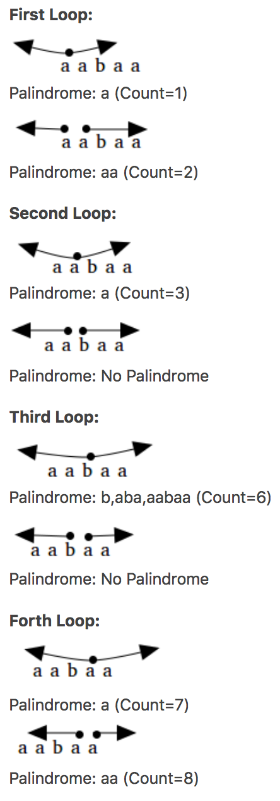

# <center>647 - Palindromic Substrings (M)</center> 


<br></br>

* Tag: String, DP
* Company: Facebook, LinkedIn
* Difficulty: Medium
* Link: https://www.lintcode.com/problem/palindromic-substrings/description

<br></br>


## Description
----
Given a string, your task is to count how many palindromic substrings in this string.

The substrings with different start indexes or end indexes are counted as different substrings even they consist of same characters.

<br></br>


## Example
----
1. Input: "abc" Output: 3 "a", "b", "c".
2. Input: "aba" Output: 4 "a", "b", "a", "aba".

<br></br>


## Solution
----
**动态规划做法：**

如果`substring(i, j)`是回文串，那么`str[i]`和`str[j]`相同，且满足以下两条件之一：
1. `substring(i+1, j-1)`是回文串
2. `j-i <= 2`，即`substring(i,j)`长度小于2

顺着这个思路动态规划即可。

**双指针：**
以`aabaa`为例。

首先，定义一个帮助函数：
1. `checkPalindrome(s,i,i)`检查偶数长度的回文子串。
2. `checkPalindrome(s,i,i+1)`检查奇数长度的回文子串。

然后，从0开始遍历字符串。考虑到如果当前子串是回文串，那么当子串前后各加一个字符后，必须这两个字符相等才能使新的子串仍是回文串。所以有：



<br>


### Go
```go
func CountPalindromicSubstrings(s string) int {
	count := 0
	for k := range s {
		count += cpsHelper(s, k, k) + cpsHelper(s, k, k+1)
	}

	return count
}

func cpsHelper(s string, i, j int) int {
	count := 0
	for i >= 0 && j < len(s) && s[i] == s[j] {
		count++
		i--
		j++
	}

	return count
}
```

```go
func countSubstrings(s string) int {
    l, count := len(s), 0
    dp := make([][]int, l, l)
    for k := range dp {
        dp[k] = make([]int, l, l)
    }
    for i := 0; i < l; i++ {
        for j := 0; j <= i; j++ {
            dp[j][i] = 0
            if s[j] == s[i] && (i - j <= 2 || dp[j + 1][i - 1] == 1) {
                dp[j][i] = 1
            }
            count += dp[j][i]
        }
    }
    
    return count
}
```

<br>


## Python
```python
class PalindromicSubstrings:
    count = 0
    
    def countSubstrings(self, s: str) -> int:
        for i in range(len(s)):
            self.helper(s, i, i)
            self.helper(s, i, i + 1)
        
        return self.count
    
    def helper(self, s: str, i: int, j: int):
        while i >= 0 and j < len(s) and s[i] == s[j]:
            self.count += 1
            i -=1
            j += 1
```

<br>


### Java
```java
public class PalindromicSubstrings {
	/**
     * @param str: s string
     * @return: return an integer, denote the number of the palindromic substrings
     */
    public int solution1(String str) {
        int n = str.length();
        int ans = 0;
        int[][] dp = new int[n][n];
        for (int i = 0; i < n; ++i) {
            for (int j = 0; j <= i; ++j) {
                dp[j][i] = ((str.charAt (j) == str.charAt (i)) && (i - j <= 2 || dp[j + 1][i - 1] == 1)) ? 1 : 0;
                ans += dp[j][i];
            }
        }
        
        return ans;
    }
    
    public int solution2(String s) {
    	int count = 0;
        if(s == null) 
            return count;
        
        for(int i=0; i<s.length()-1; i++){
            count += checkPalindrome(s,i,i);     // Odd length palindromic sub-string
            count += checkPalindrome(s,i,i+1);   // Even length palindromic sub-string
        }
        return count;
    }    

    private int checkPalindrome(String s, int i, int j) {
    	int count = 0;
        while(i>=0 && j< s.length() && s.charAt(i) == s.charAt(j)){
            count++;
            i--;
            j++;
        }
        
        return count;
    }
}
```